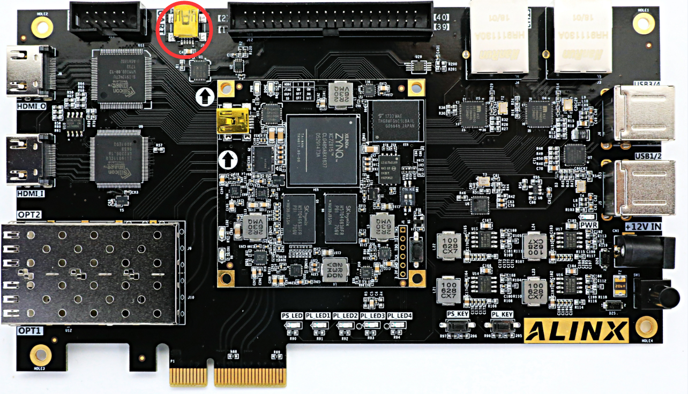
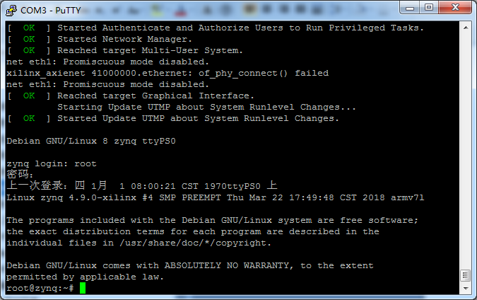
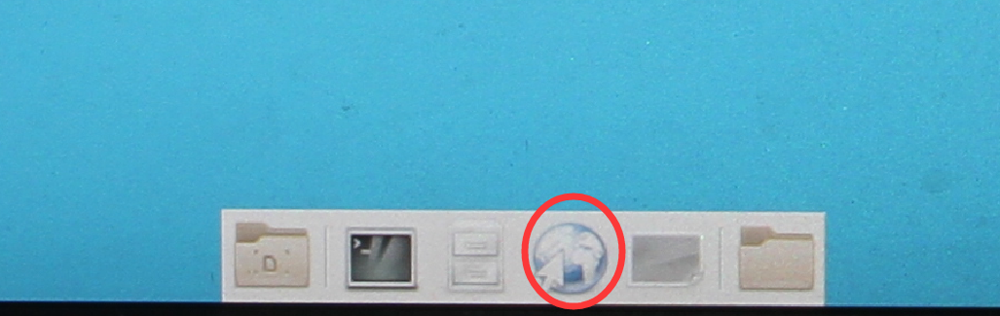

软件包说明和开发板检测
========================

为了您方便找到教程中所用到的软件、源码包、驱动等，下面会介绍一下软件包里主要内容，教程中难免有疏漏之处，找不到时麻烦您搜索一下您的电脑。

软件包说明
----------

.. image:: images/01_media/image1.png
      
1)  CP210x_Windows_Drivers.zip 串口驱动

2)  **Xilinx_Unified_2023.1_0507_1903.tar.gz** Vivado 2023.1安装包，Windows和Linux通用版本，Windows下需要WinRAR解压软件。

3)  petalinux-v2023.1-final-installer.run petalinux安装包

4)  qt-opensource-windows-x86-mingw530-5.7.1.exe Windows版本QT

5)  qt-opensource-linux-x64-5.7.1.run Linux版本QT

6)  imageUSB.exe 镜像恢复工具

7)  00_resource内包含Linux源代码、根文件系统

8)  VMware-workstation-full-12.1.1-3770994.exe 虚拟机安装包

9)  ubuntu-16.04.3-desktop-amd64.iso Ubuntu安装包，只能装在PC上，不能装开发板

10) PCIe驱动和上位机测试文件都位于“course_s1/资源文件/PCIe”

开发板检测
----------

拿到开发板，大部分人都想立即体验一下，看看开发板是否正常工作，下面我们介绍如何对开发板进行一个简单的检测。

检测需要自备的工具
~~~~~~~~~~~~~~~~~~

1) 电脑

.. image:: images/01_media/image2.png
      
2) 支持HDMI的显示器，要求分辨率不小于1920x1080

.. image:: images/01_media/image3.png
      
HDMI线缆2条

.. image:: images/01_media/image4.png
      
1) HDMI视频源

      
5) USB鼠标键盘

.. image:: images/01_media/image6.png
      
6) 路由器，为了测试网络，最好能连接互联网，支持DHCP。

.. image:: images/01_media/image7.png
      
7) 网线

.. image:: images/01_media/image8.png
      
开发板线缆连接
~~~~~~~~~~~~~~

1) 连接HDMI显示器

      
2) 连接HDMI视频源

      
3) 连接usb转串口，主要用于看ARM打印出的一些信息

      
4) 连接ARM端网口到路由器

      
5) 连接电源

      
开始测试
~~~~~~~~

1) 测试前我们需要安装USB转串口的驱动软件（软件/CP210x_Windows_Drivers.zip），不然无法做串口通信测试，双击exe文件进行驱动安装。驱动安装好以后，用红色USB线连接电脑USB口和开发板上的UART口(J1)进行连接,然后打开电脑的设备管理器，设备管理器能够找到串口设备CP210x,我机器上映射的是COM3。如果不能成功安装驱动，可以尝试使用驱动精灵安装。

.. image:: images/01_media/image14.png
      
.. image:: images/01_media/image15.png
      
.. image:: images/01_media/image16.png
      
2) 终端工具有很多，例如putty，teraterm, Windows自带终端工具，SecureCRT等等，众多终端工具中，比较下来，还是putty最好用，资料（软件/ putty.exe）为大家准备了绿色免安装的putty软件。

3) 选择Serial，Serial line填写COM3，Speed填写115200，COM3串口号根据设备管理器里显示的填写

.. image:: images/01_media/image17.png
      
选择Serial，并将流控Flow control改为None，点击“Open”

.. image:: images/01_media/image18.png
      
.. image:: images/01_media/image19.png
      
启动后界面

4) 确定开发板启动模式是否为SD启动模式（默认出厂时开发板的SD卡插槽里有卡，启动模式默认也是SD卡），拨动拨码开关时用一个带尖端的工具，例如，镊子，取卡针等，轻轻拨动。

      
5) 打开开发板上的电源开关，PuTTY工具窗口会显示u-boot和Linux系统的启动信息。

.. image:: images/01_media/image21.png
      
6) 可以在串口终端登陆系统，用户: root，密码: root

      
7) 启动完成后连接开发板HDMI显示器会显示Debian的桌面。

.. image:: images/01_media/image23.png
      
8) 这时可以使用连接到鼠标和键盘来操作了，用鼠标双击Web浏览器，启动浏览器时间较长，请耐心等待。

      
9) 地址栏输入网址，我们这里输入黑金动力社区的网址。正常打开，我们的开发板已经能正常上网了。

.. image:: images/01_media/image25.png
      
10) 给开发板断电，然后设置启动模式为QSPI启动，这个时候，开发板会启动一个HDMI输入直通HDMI输出的程序，并且含有PCIe固件。重新上电后可以看到HDMI显示器显示内容为HDMI输入视频源。

11) 如果你还想测试PCIe功能，可以给开发板插入电脑的PCIe插槽（断电插拔，使用PCIe时不需要再使用电源适配器供电）。电脑开机后就可以识别到一个新的PCI设备。

12) 开发板的简单检测到此结束。
