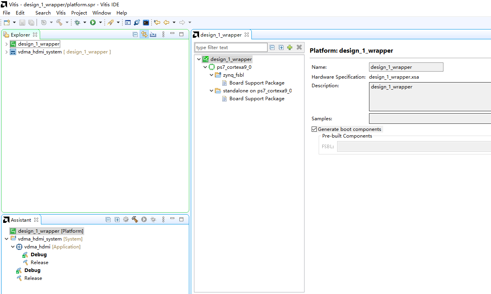
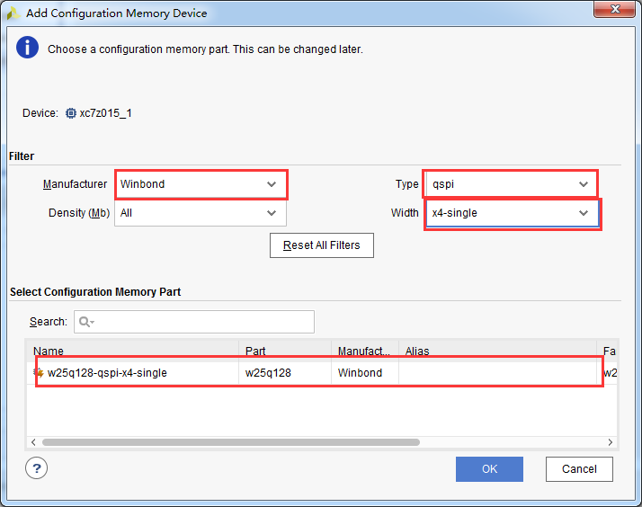

固化程序
==========

**实验VIvado工程为“vdma_to_qspi_sd”。**

做个这么多试验，都是通过JTAG调试的，怎么把程序放在SD卡或者烧写到QSPI Flash里运行？首先PL必须有PS配置，所以不能像以往的FPGA烧录方法直接烧录到Flash，本实验讲解如何固化程序。

Vivado工程建立
--------------

本实验选择VDMA测试工程来固化，在建立VDMA测试工程时，我们没有使能QSPI和SD卡，要固化程序必须使能QSPI或SD卡。

1) 将VDMA测试工程另存一份，用于固化程序实验，名称改为“vdma_to_qspi_sd”

      
2) 添加QSPI，使用MIO1-6

.. image:: images/15_media/image2.png
      
3) 添加SD0控制器，使用MIO40-45，使用TF卡接口

.. image:: images/15_media/image3.png
      
4) 添加SD卡的卡检测管脚MIO10

      
5) 保存设计，编译生成bit文件，再次导出硬件

生成FSBL
--------

FSBL是一个二级引导程序，完成MIO的分配、DDR控制器初始化、SD、QSPI控制器初始化，配置FPGA，然后加载用户程序。

1) 启动Vitis软件。

      
2) 新建一个名为fsbl的APP。

.. image:: images/15_media/image6.png
      
3) 模板选择Zynq FSBL

.. image:: images/15_media/image7.png
      
4) 添加调试宏定义FSBL_DEBUG_INFO，可以在启动输出FSBL的一些状态信息，有利于调试，但是会导致启动时间变长。

      
5) 保存编译Vitis，生成fsbl.elf文件

创建BOOT文件
------------

1) 选择fsbl工程，右键选择Create Boot Image

.. image:: images/15_media/image9.png
      
2) 弹出的窗口中可以看到生成的BIF文件路径，BIF文件是生成BOOT文件的配置文件，还有生成的BOOT.bin文件路径，BOOT.bin文件是我们需要的启动文件，可以放到SD卡启动，也可以烧写到QSPI Flash。

.. image:: images/15_media/image10.png
      
3) 在Boot image partitions列表中有要合成的文件，第一个文件一定是bootloader文件，就是上面生成的fsbl.elf文件，第二个文件是FPGA配置文件，现在点击Add添加我们的VDMA测试程序vdma_hdmi.elf

.. image:: images/15_media/image11.png
      
4) 点击Create Image生成

      
5) 在生成的目录下可以找到BOOT.bin文件

.. image:: images/15_media/image13.png
      
SD卡启动测试
------------

1) 格式化SD卡，只能格式化为FAT32格式，其他格式无法启动

.. image:: images/15_media/image14.png
      
2) 放入BOOT.bin文件，放在根目录

.. image:: images/15_media/image15.png
      
3) SD卡插入开发板的SD卡插槽

4) 启动模式调整为SD卡启动

      
5) 插上HDMI显示器，给开发板上电，可以看到显示器显示了小猫的图片

QSPI启动测试
------------

1) 在菜单Vitis -> Program Flash

.. image:: images/15_media/image17.png
      
2) Image FIle文件选择要烧写的BOOT.bin，模式调整为JTAG。

      
关于定制版本fsbl的来源，可以参考xilinx官网链接：\ https://www.xilinx.com/support/answers/70148.html （如果链接失效，可以在xilinx官网搜索AR# 70148）

.. image:: images/15_media/image19.png
      
.. image:: images/15_media/image20.png
      
**注意：**\ 如果使用Vivado 2019.1及以后版本就不需要这个定制的fsbl，用自己生成的fsbl即可。

3) 点击Program等待烧写完成

.. image:: images/15_media/image21.png
      
4) 烧写完成后设置启动模式为QSPI，再次启动，可以看到显示器有显示输出

Vivado下烧写QSPI 
-----------------

1) 在HARDWARE MANGER下选择器件，右键Add Configuration Memory Device

      
2) 选择尝试Winbond，类型选择qspi，宽度选择x4-single，这时候出现一个w25q128，开发板使用w25q256，但是不影响烧录。

      
3) 右键选择编程文件

      
4) 选择要烧写的文件和芯驿电子定制的fsbl文件，就可以烧写了，如果烧写时不是JTAG启动模式，软件会给出一个警告，所以建议烧写QSPI的时候设置到JTAG启动模式

      
使用批处理文件快速烧写QSPI
--------------------------

1) 新建一个program_qspi.txt文本文件，扩展名改为bat,内容填写如下，其中set XIL_CSE_ZYNQ_DISPLAY_UBOOT_MESSAGES=1设置显示烧写过程中的uboot打印信息，

..

   C:\\Xilinx\\Vitis\\2023.1\\bin\\program_flash
   为我们工具路径，按照安装路径适当修改，-f
   为要烧写的文件，-fsbl为要烧写使用的fsbl文件，-blank_check
   -verify为校验选项。

::

 set XIL_CSE_ZYNQ_DISPLAY_UBOOT_MESSAGES=1
 call C:\Xilinx\Vitis\2023.1\bin\program_flash -f BOOT.bin  -fsbl fsbl.elf  -offset 0 -flash_type qspi_single  -blank_check -verify
 pause

1) 把要烧录的BOOT.bin、fsbl、bat文件放在一起

      
3) 插上JTAG线后上电，双击bat文件即可烧写flash。

      