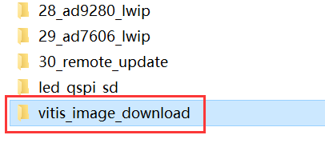
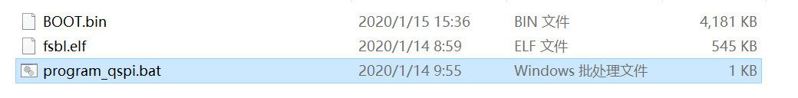
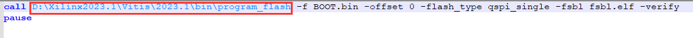
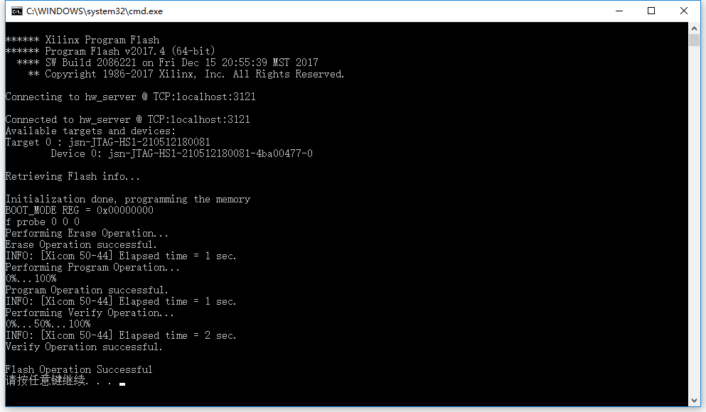

准备工程及注意事项
====================

软件环境
--------

软件开发环境基于Vivado 2023.1

.. image:: images/000_media/image1.png
         
硬件环境
--------

+---------------------------------+------------------------------------+
| 开发板型号                      | 芯片型号                           |
+=================================+====================================+
| AX7015                          | XCZ7015-2CLG485                    |
+---------------------------------+------------------------------------+
| AX7010                          | XCZ7010-1CLG400                    |
+---------------------------------+------------------------------------+
| AX7020                          | XCZ7020-2CLG400                    |
+---------------------------------+------------------------------------+
| AX7021                          | XC7Z020-2CLG484                    |
+---------------------------------+------------------------------------+

工程对应
--------

+----------------------------------+-----------------------------------+
| 章节名称                         | 工程目录                          |
+==================================+===================================+
| PS端MIO操作之点亮LED灯           | ps_led                            |
+----------------------------------+-----------------------------------+
| PS端MIO操作之按键中断            | ps_key                            |
+----------------------------------+-----------------------------------+
| PS端UART读写控制                 | ps_uart                           |
+----------------------------------+-----------------------------------+
| XADC的使用                       | ps_xadc                           |
+----------------------------------+-----------------------------------+
| PL读写PS端DDR数据                | pl_read_write_ps_ddr              |
+----------------------------------+-----------------------------------+
| 通过BRAM实现PS与PL数据交互       | bram_test                         |
+----------------------------------+-----------------------------------+
| 双核AMP的使用                    | dualcore_amp                      |
+----------------------------------+-----------------------------------+
| ZYNQ下使用Free RTOS              | freeos_test                       |
+----------------------------------+-----------------------------------+
| DMA环通测试                      | dma_loopback                      |
+----------------------------------+-----------------------------------+
| DMA使用之DAC波形发生器（AN108）  | ad9708_dma                        |
+----------------------------------+-----------------------------------+
| DMA使用之ADC示波器（AN108）      | ad9280_dma_hdmi                   |
+----------------------------------+-----------------------------------+
| DMA使用之ADC示波器（AN9238）     | ad9238_dma_hdmi                   |
+----------------------------------+-----------------------------------+
| DMA使用之ADC示波器（AN706）      | ad7606_dma_hdmi                   |
+----------------------------------+-----------------------------------+
| 基于ADC模块的Scatter/Gather      | ad9280_sg_dma_hdmi                |
| DMA使用(AN108)                   |                                   |
+----------------------------------+-----------------------------------+
| 基于DAC模块的Scatter/Gather      | ad9767_sg_dma                     |
| DMA使用(AN9767)                  |                                   |
+----------------------------------+-----------------------------------+
| OV5640摄像头的采集显示一         | ov5640_single                     |
+----------------------------------+-----------------------------------+
| OV5640摄像头的采集显示二         | ov5640_dual                       |
+----------------------------------+-----------------------------------+
| 双目摄像头以太网传输             | an5642_lwip_double                |
+----------------------------------+-----------------------------------+
| 7寸液晶屏模块的使用              | lcd7_display                      |
+----------------------------------+-----------------------------------+
| 7寸触摸屏的使用                  | lcd7_touch                        |
+----------------------------------+-----------------------------------+
| SD卡读写操作之BMP图片显示        | sd_hdmi_out                       |
+----------------------------------+-----------------------------------+
| SD卡读写操作之摄像头抓拍         | ov5640_sd                         |
+----------------------------------+-----------------------------------+
| 基于                             | ad9238_lwip                       |
| AN9238模块的ADC采集之以太网传输  |                                   |
+----------------------------------+-----------------------------------+
| 基                               | ad7606_lwip                       |
| 于AN706模块的ADC采集之以太网传输 |                                   |
+----------------------------------+-----------------------------------+
| 基                               | ad9280_lwip                       |
| 于AN108模块的ADC采集之以太网传输 |                                   |
+----------------------------------+-----------------------------------+
| 基于UDP/TCP的远程更新QSPI FLASH  | remote_update                     |
+----------------------------------+-----------------------------------+

注意事项
--------

所有的工程目录下都有个bootimage文件夹，存放了对应的BOOT.bin文件，可将此文件拷贝到Vitis_image_download文件夹，覆盖原有的BOOT.bin。

.. image:: images/000_media/image2.png
      
vitis_image_download文件夹在course_s2_vitis目录下面，进入文件夹，右键点击program_qspi.bat，打开编辑

      

      
将program_flash路径改成自己的软件安装路径

      
双击，即可下载到QSPI FLASH，建议用JTAG模式下载。

      
也可以采用SD卡启动方法，把BOOT.bin文件拷贝到SD内，启动方法前面在基础篇已经讲过，不再赘述。
