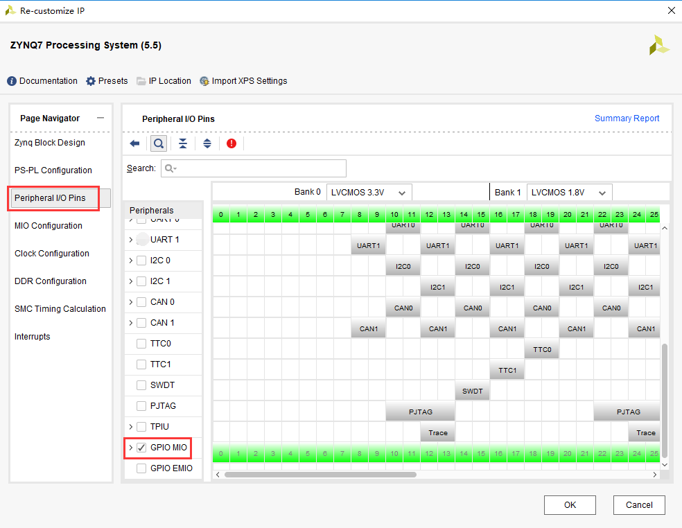
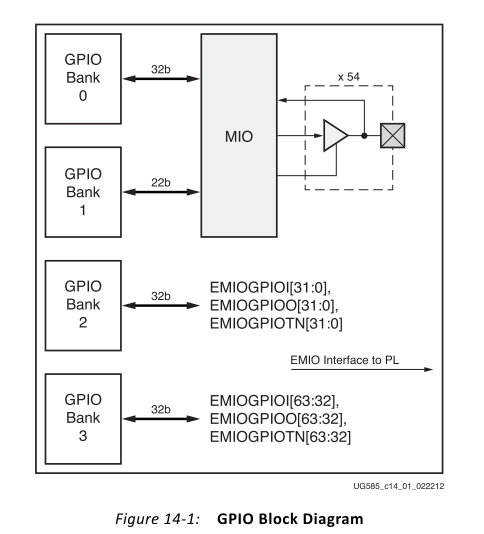
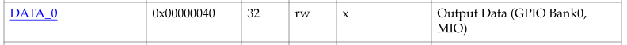

PS端MIO操作之点亮LED灯
========================

本章介绍PS端MIO的操作，MIO是基础的外设IO，可以连接诸如SPI，I2C，UART，GPIO等，通过VIVADO软件设置，软件可以将信号通过MIO导出，同样也可以将信号通过EMIO连接到PL端的引脚上。

MIO共有两个BANK，BANK0有16个引脚，BANK1为38个引脚，共54个引脚，两个BANK的电压需要注意选择正确。

.. image:: images/01_media/image1.png
      
本实验通过实现PS端LED灯的闪烁演示MIO的操作。

硬件环境搭建
------------

本实验基于course_s1中的“体验ARM，裸机输出“Hello Wolrd”工程。

1. 打开ZYNQ配置界面，在Peripheral I/O Pins界面勾选GPIO MIO，用来控制PS端的MIO，点击OK

      
2. Generate Output Products

      
3. 由于不需要生成FPGA烧写文件，直接点击FileExportExport Hardware，不用勾选include bitstream选项，生成Hardware信息，此时会生成新的Vitis目录。

      
4. 点击ToolsLaunch Vitis进入Vitis

      
Vitis程序开发
-------------

首先在AX7015和AX7021底板的原理图中看到PS端LED连接到了PS端的MIO9；AX7020和AX7010的LED灯连接到了PS端的MIO0和MIO13，可以根据相应的开发板MIO的位置控制LED灯。

      
AX7015、AX7021原理图

.. image:: images/01_media/image8.png
      
AX7020/AX7010原理图

1. 新建工程

.. image:: images/01_media/image9.png
      
1) 点击Next

.. image:: images/01_media/image10.png
         
2) 点击“Create a new platform hardware(XSA)，软件已经提供了一些板卡的硬件平台，但对于我们自己的硬件平台，可以选择”+”

.. image:: images/01_media/image11.png
         
3) 选择之前生成的xsa，点击打开

.. image:: images/01_media/image12.png
         
4) 最下面的Generate boot components选项，如果勾选上，软件会自动生成fsbl工程，我们一般选择默认勾选上。点击Next

.. image:: images/01_media/image13.png
         
5) 项目名称填入“hello”，也可以根据自己的需要填写,CPU默认选择ps7_cortexa9_0，OS选择standalone，点击Next

      
.. image:: images/01_media/image15.png
         
6) 模板选择Hello World，点击Finish

.. image:: images/01_media/image16.png
         
7) 完成之后可以看到生成了两个工程，一个是硬件平台工程，即之前所说的Platfrom工程，一个是APP工程

      
2. 在编写程序之前，先来了解GPIO的BANK分布，在UG585文档GPIO一章中可以看到GPIO是有4个BANK，注意与MIO的BANK区分。BANK0控制32个信号，BANK1控制22个信号，总共是MIO的54个引脚，BANK2和BANK3共能控制64个PL端引脚，每一组都有三个信号，输入EMIOGPIOI，输出EMIOGPIOO，输出使能EMIOGPIOTN，共192个信号。

      
3. 下图为GPIO的控制，实验中会用到输出部分的寄存器，数据寄存器DATA，数据掩码寄存器MASK_DATA_LSW，MASK_DATA_MSW，方向控制寄存器DIRM，输出使能控制器OEN。

.. image:: images/01_media/image19.png
      
4. 再来看GPIO的寄存器，可以打开UG585文档的最下面Register Details，找到General Purpose I/O部分。

.. image:: images/01_media/image20.png
      
5. 实验中可能会用到的寄存器：

数据掩码寄存器，例如MIO 9在GPIO的BANK0，可以屏蔽其他BANK0中的其他31位。

.. image:: images/01_media/image21.png
      
方向寄存器，控制数据的方向

.. image:: images/01_media/image22.png
      
输出使能寄存器

.. image:: images/01_media/image23.png
      
数据寄存器，有效的数据

      
具体的寄存器含义就不一一讲解了，大家自行研究。

6. 理解了需要对哪些寄存器操作，下面就可以开始写程序，已经为大家准备好了程序，我们采用XILINX提供的库函数，可以在bsp的include文件夹中找到。

      
在里面可以找到xgpiops.h，里面包含了很多xilinx准备好的库函数，xgpiops_hw.h有许多宏定义以及读写操作宏定义。

      
程序中利用以下函数设置方向和输出使能（根据不同的开发板修改MIO值）：

      
每1秒将数据翻转，实现LED灯1秒间隔的亮灭（根据不同的开发板修改MIO值）：

.. image:: images/01_media/image28.png
      
7. 打开Run Configurations界面

      
8. 双击system debugger新建，Hardware Platform选择正确，点击Run

      
9. 运行完成后，就可以看到PS端的LED灯开始闪烁。AX7015开发板丝印为PS_LED。AX7021开发板丝印为LED1。AX7020和AX7010开发板丝印为PS
   LED1。

软件使用技巧
------------

1. 在bsp的include文件夹下包含了xilinx的各种头文件，如本章用到的GPIO，用到了xgpiops.h，在此文件中可以看到各种宏定义，在调用GPIO函数时可以使用这些宏定义，提高可读性。

      
同时也包含外设自带的函数声明

.. image:: images/01_media/image32.png
      
2. 在xparameters.h头文件中定义了各个外设的基地址，器件ID，中断等

.. image:: images/01_media/image33.png
      
3. 在libsrc文件夹中，包含外设函数的定义，使用说明

      
4. 在src文件夹下的lscript.ld中，定义了可用memory空间，栈和堆空间大小等，可根据需要修改。

      
本章小结
--------

本章介绍了MIO的输出控制，以及GPIO的使用，在学习过程中，一定要多看文档，结合模块结构以及寄存器含义加深理解。参考文档UG585。
