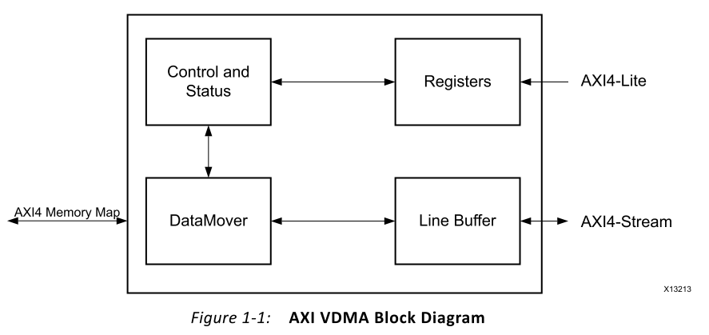
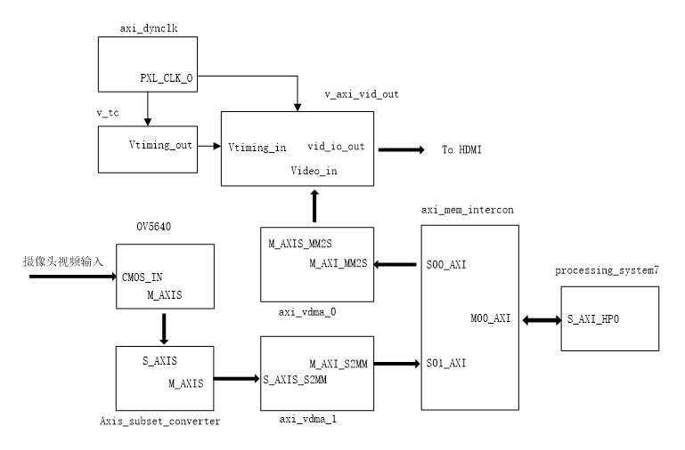
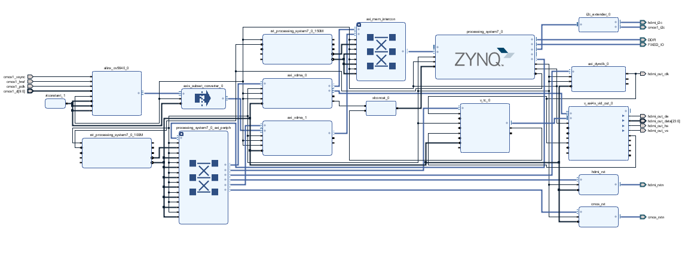
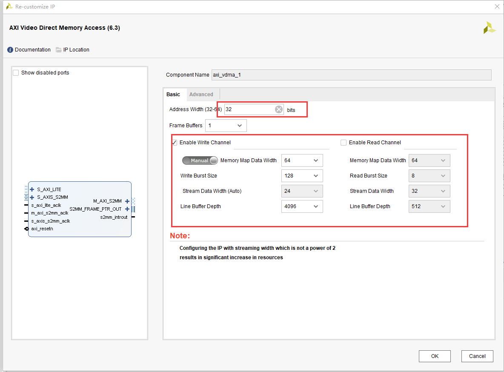
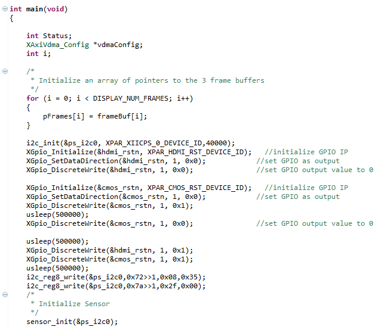
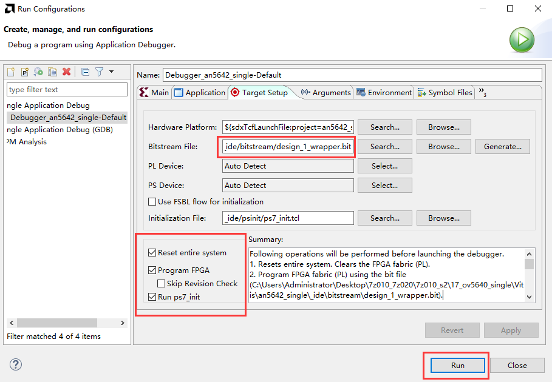
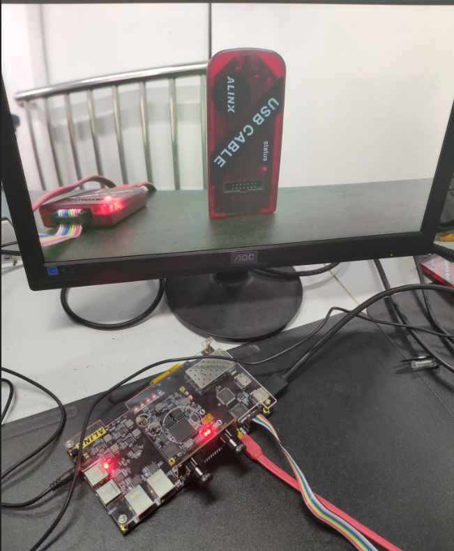
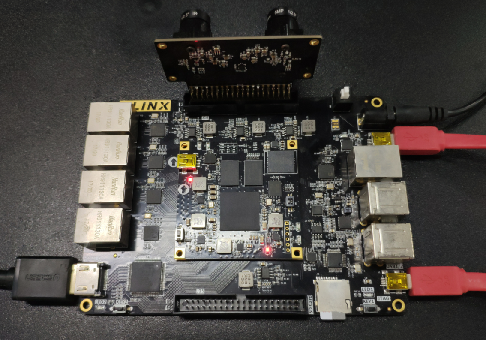
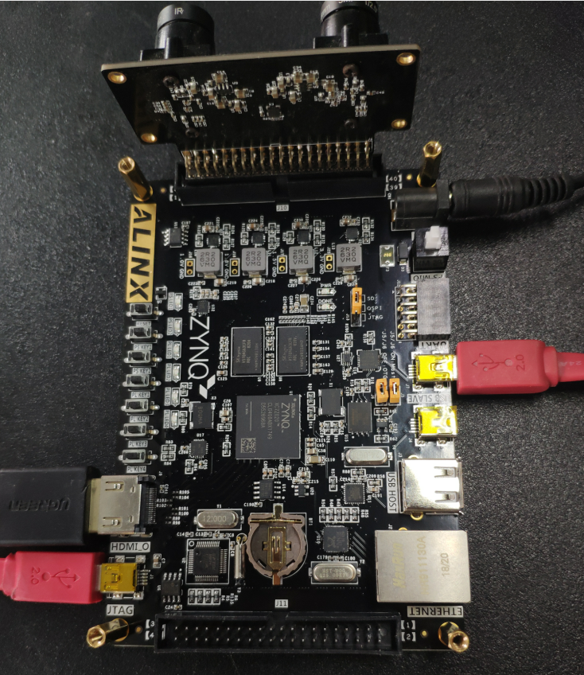
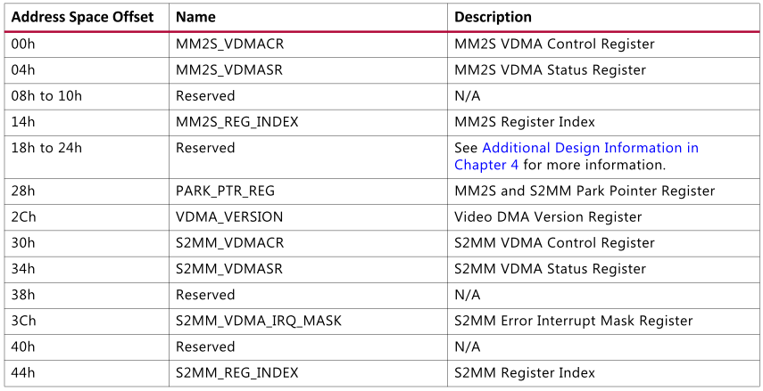

OV5640摄像头的采集显示一
==========================

本章讲解 OV5640 模块的使用，使用的硬件是黑金双目摄像头模块（AN5642）。主要学习 vdma 视频输入、AXI Stream 等，对基于 ZYNQ 的视频处理有个基本的了解。

OV5640简介
----------

图像传感器是摄像头的核心部件，黑金双目摄像头模块 AN5642 中的图像传感器是一款型号为 OV5640 的 CMOS
类型数字图像传感器。该传感器支持输出最大为 500 万像素的图像 (2592x1944 分辨率)，支持使用 VGA 时序输出图像数据，支持 DVP（DC）、MIPI
接口输出图像的数据格式支持 YUV(422/420)、YCbCr422、RGB565、RAW 以及 JPEG 格式，若直接输出
JPEG格式的图像时可大大减少数据量，方便网络传输。它还可以对采集得的图像进行补偿，支持伽曲线、白平衡、饱和度、色度等基础处理。根据不同的分辨率配置，传感器输出图像数据的帧率从 15-60 帧可调，工作时功率在 150mW-200mW 之间。

OV5640 使用 SCCB 总线配置，SCCB 和 I2C 总线兼容，AN5642 模块使用 DVP 传输视频，PCLK 为像素时钟，HREF 为行同步信号，当 HREF
为高时视频数据有效，VSYNC 为场同步信号。数据线为 10Bit，我们的程序只使用其中的 8Bit。在黑金的 FPGA 开发板中我们常常配置为
RGB565 输出，在黑金的专业视频处理板中配置为 YCbCr422，因为数据总线是 8Bit，所以2 个时钟周期传输一个像素的数据，在 FPGA 接收端再拼接成完整的像素数据。

VDMA的使用
----------

在前面的课程中我们已经使用了 VDMA 进行了 HDMI 的显示，VDMA 是 xilinx 的视频处理中一个很关键的 IP，VDMA 是一个特殊的
DMA，针对视频处理做了特殊的设计。如下图所示，我们看到 VDMA 有个 AXI4 Memory Map 接口，用于对存储器进行读写视频数据，一个AXI4-Lite
接口用于读取 VDMA 状态以及配置 VDMA 的参数，还有 AXI4-Stream 接口，用于视频的输入和输出。

      
VDMA 的配置也是很重要的，笔者摘录了 VMDA 的寄存器，我们根据文档《AXI Video Direct Memory Access v6.3》编写了简单的 VDMA 控制程序，如下所示：

|image1|\ |image2|

.. code:: c

 #include "xil_printf.h"
 #include "vdma.h"
 
 u32 vdma_version(XAxiVdma *Vdma){
 	return XAxiVdma_GetVersion(Vdma);
 }
 
 int vdma_read_start(XAxiVdma *Vdma){
 	int Status;
 
 	// MM2S Startup
 	Status = XAxiVdma_DmaStart(Vdma, XAXIVDMA_READ);
 	if(Status != XST_SUCCESS)
 	{
 	   xil_printf("Start read transfer failed %d\n\r", Status);
 	return XST_FAILURE;
 	}
 
 	return XST_SUCCESS;
 }
 
 
 int vdma_read_stop(XAxiVdma *Vdma){
 	XAxiVdma_DmaStop(Vdma, XAXIVDMA_READ);
 	return XST_SUCCESS;
 }
 
 
 int vdma_read_init(short DeviceID,short HoriSizeInput,short VertSizeInput,short Stride,unsignedint FrameStoreStartAddr)
 {
 	XAxiVdma Vdma;
 	XAxiVdma_Config *Config;
 	XAxiVdma_DmaSetup ReadCfg;
 	int Status;
 
 
 	Config = XAxiVdma_LookupConfig(DeviceID);
 	if(NULL== Config){
 		xil_printf("XAxiVdma_LookupConfig failure\r\n");
 		return XST_FAILURE;
 	}
 
 	Status = XAxiVdma_CfgInitialize(&Vdma, Config, Config->BaseAddress);
 	if(Status != XST_SUCCESS){
 		xil_printf("XAxiVdma_CfgInitialize failure\r\n");
 		return XST_FAILURE;
 	}
 
 	
 
 	ReadCfg.EnableCircularBuf =1;
 	ReadCfg.EnableFrameCounter =0;
 	ReadCfg.FixedFrameStoreAddr =0;
 
 	ReadCfg.EnableSync =1;
 	ReadCfg.PointNum =1;
 
 	ReadCfg.FrameDelay =0;
 
 	ReadCfg.VertSizeInput = VertSizeInput;
 	ReadCfg.HoriSizeInput = HoriSizeInput;
 	ReadCfg.Stride = Stride;
 
 	Status = XAxiVdma_DmaConfig(&Vdma, XAXIVDMA_READ,&ReadCfg);
 	if(Status != XST_SUCCESS){
 			xdbg_printf(XDBG_DEBUG_ERROR,
 				"Read channel config failed %d\r\n", Status);
 
 			return XST_FAILURE;
 	}
 
 
 	ReadCfg.FrameStoreStartAddr[0]= FrameStoreStartAddr;
 
 	Status = XAxiVdma_DmaSetBufferAddr(&Vdma, XAXIVDMA_READ, ReadCfg.FrameStoreStartAddr);
 	if(Status != XST_SUCCESS){
 			xdbg_printf(XDBG_DEBUG_ERROR,"Read channel set buffer address failed %d\r\n", Status);
 			return XST_FAILURE;
 	}
 
 
 	Status = vdma_read_start(&Vdma);
 	if(Status != XST_SUCCESS){
 		   xil_printf("error starting VDMA..!");
 		return Status;
 	}
 	return XST_SUCCESS;
 
 }
 
 
 int vdma_write_start(XAxiVdma *Vdma){
 	int Status;
 
 	// MM2S Startup
 	Status = XAxiVdma_DmaStart(Vdma, XAXIVDMA_WRITE);
 	if(Status != XST_SUCCESS)
 	{
 	   xil_printf("Start write transfer failed %d\n\r", Status);
 	return XST_FAILURE;
 	}
 
 	return XST_SUCCESS;
 }
 
 
 int vdma_write_stop(XAxiVdma *Vdma){
 	XAxiVdma_DmaStop(Vdma, XAXIVDMA_WRITE);
 	return XST_SUCCESS;
 }
 
 
 int vdma_write_init(short DeviceID,short HoriSizeInput,short VertSizeInput,short Stride,unsignedint FrameStoreStartAddr)
 {
 	XAxiVdma Vdma;
 	XAxiVdma_Config *Config;
 	XAxiVdma_DmaSetup WriteCfg;
 	int Status;
 
 
 	Config = XAxiVdma_LookupConfig(DeviceID);
 	if(NULL== Config){
 		xil_printf("XAxiVdma_LookupConfig failure\r\n");
 		return XST_FAILURE;
 	}
 
 	Status = XAxiVdma_CfgInitialize(&Vdma, Config, Config->BaseAddress);
 	if(Status != XST_SUCCESS){
 		xil_printf("XAxiVdma_CfgInitialize failure\r\n");
 		return XST_FAILURE;
 	}
 
 	
 
 	WriteCfg.EnableCircularBuf =1;
 	WriteCfg.EnableFrameCounter =0;
 	WriteCfg.FixedFrameStoreAddr =0;
 
 	WriteCfg.EnableSync =1;
 	WriteCfg.PointNum =1;
 
 	WriteCfg.FrameDelay =0;
 
 	WriteCfg.VertSizeInput = VertSizeInput;
 	WriteCfg.HoriSizeInput = HoriSizeInput;
 	WriteCfg.Stride = Stride;
 
 	Status = XAxiVdma_DmaConfig(&Vdma, XAXIVDMA_WRITE,&WriteCfg);
 	if(Status != XST_SUCCESS){
 			xdbg_printf(XDBG_DEBUG_ERROR,
 				"Read channel config failed %d\r\n", Status);
 
 			return XST_FAILURE;
 	}
 
 
 	WriteCfg.FrameStoreStartAddr[0]= FrameStoreStartAddr;
 
 	Status = XAxiVdma_DmaSetBufferAddr(&Vdma, XAXIVDMA_WRITE, WriteCfg.FrameStoreStartAddr);
 	if(Status != XST_SUCCESS){
 			xdbg_printf(XDBG_DEBUG_ERROR,"Write channel set buffer address failed %d\r\n", Status);
 			return XST_FAILURE;
 	}
 
 
 	Status = vdma_write_start(&Vdma);
 	if(Status != XST_SUCCESS){
 		   xil_printf("error starting VDMA..!");
 		return Status;
 	}
 	return XST_SUCCESS;
 
 }

硬件工程的建立
--------------

OV5640显示的硬件工程是在我们前面的例程VDMA驱动HDMI显示的基础上添加了OV5640的输入部分，主要是添加了一个VMDA，用于OV5640的输入，这里为了调试方便，视频的输入和输出不使用同一个VMDA，构架好的系统大致如下所示：

下图为实际的工程图：

      
alinx_ov5640模块是自定义IP，作用是将摄像头输入的RGB565转换成AX4-Stream格式，其中包含一个cmos_8_16bit模块，用来把8位摄像头输入的数据转化为16位RGB565格式，这时输出的RGB565是2个时钟周期一个像素，其中一个时钟周期是无用数据，cmos_8_16bit使用de_o来指示像素数据是否有效，de_o在一行视频数据中不是连续的，cmos_8_16bit的hblank是一个行同步信号，用于指示一行的像素数据。另一个模块cmos_in_axi4s是一个把摄像头的RGB565数据转化为AXI4-Stream的模块，这个模块的代码修改的xilinx的“Video In to
AXI4-Stream“这样一个IP，这个IP输入是一个标准的视频格式，摄像头的RGB565无法直接输入。

AXI_VMDA1的配置，我们这里只使能写通道，读通道不使能，在Advanced选项卡里我们的Fsync Options选择s2mm tuser，用于数据的同步，同时使能了不对齐传输。要说明的是，如果没有使能不对齐传输，VDMA的缓冲区地址必须是8字节对齐的。

      
.. image:: images/16_media/image7.png
      
Vitis程序开发
-------------

1. 基于VDMA的HDMI显示例程，添加了ov5640.c和ov5640.h，用于i2c初始化摄像头，添加vdma.c和vdma.h，用于vdma的初始化及读写控制

.. image:: images/16_media/image8.png
      
2. 在display_demo.c的main函数中，首先进行HDMI和sensor的复位，Sensor的初始化。AX7020和AX7010开发板没有HDMI的复位和HDMI的I2C配置。

      
3. 再进行显示的设置

.. image:: images/16_media/image10.png
      
4. 最后是读Sensor的VDMA设置

.. image:: images/16_media/image11.png
      
板上验证
--------

和前面的例程一样编译生成bit文件，导出硬件信息，然后运行Vitis。在run或debug的时候还是和前面的教程一样要配置一下，这样可以增加调试成功的概率，由于zynq体系构架比以往的arm处理器复杂，很多外设都是不确定的，有些外设可能处于错误状态，导致调试失败。

      
程序运行后，就能在HDMI显示器里显示摄像头的图像了。

      
AX7015硬件连接及显示

      
AX7021硬件连接图（J16扩展口）

      
AX7020/AX7010硬件连接图(J10扩展口)

本章小结
--------

本章涉及到内容非常广泛，对于刚接触zynq，特别是只有FPGA或只有arm基础的开发者理解起来比较困难，主要知识点就是视频基本知识，RGB656、视频时序，AXI总线，I2C，VDMA等，需要很长时间去消化。通过这样的例程让我们认识到zynq soc系统的灵活性，可以解决很多ARM或FPGA很难解决的问题。

.. |image2| image:: images/16_media/image3.png
      