 芯驿电子科技（上海）有限公司 基于XILINX
ZYNQ7000开发平台的开发板（型号：AX7015B）2018款正式发布了，为了让您对此开发平台可以快速了解，我们编写了此用户手册。

这款ZYNQ7000
FPGA开发平台采用核心板加扩展板的模式，方便用户对核心板的二次开发利用。核心板使用XILINX的Zynq7000
SOC 芯片XC7Z015的解决方案，它采用ARM+FPGA SOC技术将双核ARM Cortex-A9
和FPGA 可编程逻辑集成在一颗芯片上。另外核心板上含有2片共1GB高速DDR3
SDRAM芯片，1片8GB的eMMC存储芯片和1片256Mb的QSPI FLASH芯片。

在底板设计上我们为用户扩展了丰富的外围接口，比如1个PCIex2接口、2路光纤接口、2路千兆以太网接口、4路USB2.0
HOST接口、1路HDMI输入接口、1路HDMI输出接口，1路UART串口接口、1路SD卡接口、一个40针扩展接口等等。满足用户各种高速数据交换，数据存储，视频传输处理以及工业控制的要求，是一款"专业级“的ZYNQ开发平台。为高速数据传输和交换，数据处理的前期验证和后期应用提供了可能。相信这样的一款产品非常适合从事ZYNQ开发的学生、工程师等群体。

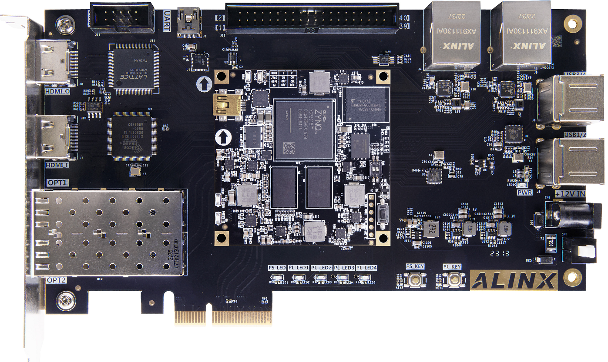

开发板简介
==========

在这里，对这款AX7015B ZYNQ开发平台进行简单的功能介绍。

开发板的整个结构，继承了我们一贯的核心板+扩展板的模式来设计的。核心板和扩展板之间使用高速板间连接器连接。

核心板主要由ZYNQ7015 + 2个DDR3 + eMMC + QSPI
FLASH的最小系统构成，承担ZYNQ系统的高速数据处理和存储的功能，
ZYNQ7015和两片DDR3之间的数据位宽为32位，两片DDR3容量高达1GB。8GB的eMMC
FLASH存储芯片和256Mb的QSPI
FLASH用来静态存储ZYNQ的操作系统、文件系统及用户数据，用户可以通过核心板上的拨码开关来选择不同的启动方式。ZYNQ7015
采用Xilinx公司的Zynq7000系列的芯片，型号为XC7Z015-2CLG485。ZYNQ7015芯片可分成处理器系统部分Processor
System（PS）和可编程逻辑部分Programmable Logic（PL）。

底板为核心板扩展了丰富的外围接口，其中包含1个PCIex2接口、2路光纤接口、2路千兆以太网接口、4路USB2.0
HOST接口、1路HDMI输入接口、1路HDMI输出接口，1路UART串口接口、1路SD卡接口、1个40针扩展接口和一些按键LED。

下图为整个开发系统的结构示意图：

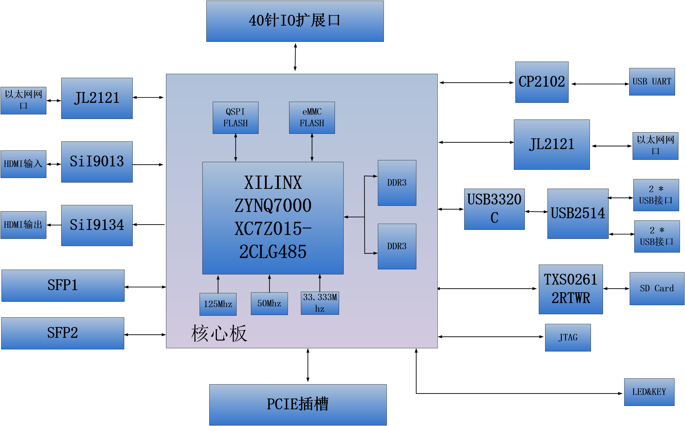

通过这个示意图，我们可以看到，我们这个开发平台所能含有的接口和功能。

-   ZYNQ7000核心板

由XC7Z015+1GB DDR3+8GB eMMC FLASH + 256Mb QSPI
FLASH组成，另外有两个晶振提供时钟，一个是33.3333MHz提供给PS系统，另一个是50MHz提供给PL逻辑，一路GTP差分参考时钟，频率125Mhz。

-  1路PCIe x2接口

支持PCI Express 2.0标准，提供标准的PCIe
x2高速数据传输接口，单通道通信速率可高达5GBaud。

-  2路SFP光纤接口

ZYNQ的GTP收发器的2路高速收发器连接到2个光模块的发送和接收，实现2路高速的光纤通信接口。每路的光纤数据通信接收和发送的速度高达6.25Gb/s。

-  千兆以太网接口

2路10/100M/1000M以太网RJ45接口，用于和电脑或其它网络设备进行以太网数据交换。网络接口芯片采用景略公司的JL2121工业级GPHY芯片，1路以太网连接到ZYNQ芯片的PS端，1路以太网连接到ZYNQ芯片的PL端。

-  HDMI视频输出

1路HDMI视频输出接口，我们选用了Silion Image公司的SIL9134
HDMI编码芯片，最高支持1080P@60Hz输出，支持3D输出。

-  HDMI视频输入

1路HDMI视频输入接口，我们选用了Silion Image公司的SIL9013
HDMI解码芯片，最高支持1080P@60Hz输入，支持不同格式的数据输入。

-  USB2.0 HOST接口

通过USB Hub芯片扩展4路USB
HOST接口，用于连接外部的USB从设备，比如连接鼠标，键盘，U盘等等。USB接口采用扁型USB接口(USB
Type A)。

-  USB Uart接口

2路Uart转USB接口，用于和电脑通信，方便用户调试。1路在核心板上，核心板独立工作是使用，1路在底板上，
整板调试时使用。串口芯片采用Silicon Labs CP2102GM的USB-UAR芯片,
USB接口采用MINI USB接口。

-  Micro SD卡座

1路Micro SD卡座，用于存储操作系统镜像和文件系统。

-  40针扩展口

1个40针2.54mm间距的扩展口，可以外接黑金的各种模块（双目摄像头，TFT
LCD屏，高速AD模块等等）。扩展口包含5V电源1路，3.3V电源2路，地3路，IO口34路。

-  USB JTAG口

1个10针2.54mm标准的JTAG口，用于FPGA程序的下载和调试，用户可以通过XILINX下载器对ZYNQ系统进行调试和下载。

-  LED灯

10个发光二极管LED,
核心板上4个，底板上6个。核心板上1个电源指示灯；1个DONE配置指示灯；2个用户指示灯。底板上有1个电源指示灯，5个用户指示灯。

-  按键

3个按键，1个复位按键在核心板上，2个用户按键在底板上。

AC7015B核心板
=============

简介
----

AC7015B(**核心板型号，下同**)核心板，ZYNQ芯片是基于XILINX公司的ZYNQ7000系列的XC7Z015-2CLG485I。ZYNQ芯片的PS系统集成了两个ARM
Cortex™-A9处理器，AMBA®互连，内部存储器，外部存储器接口和外设。ZYNQ芯片的FPGA内部含有丰富的可编程逻辑单元，DSP和内部RAM。

这款核心板使用了2片SK
Hynix公司的H5TQ4G63AFR-PBI这款DDR3芯片，每片DDR的容量为4Gbit；2片DDR芯片组合成32bit的数据总线宽度，ZYNQ和DDR3之间的读写数据时钟频率高达533Mhz；这样的配置，可以满足系统的高带宽的数据处理的需求。

为了和底板连接，这款核心板的4个板对板连接器扩展出了PS端的USB接口，千兆以太网接口，SD卡接口及其它剩余的MIO口；也扩展出了ZYNQ的4对高速收发器GTP接口；以及PL端的BANK13,
BAN34和BANK35的几乎所有IO口（84个），其中BANK35的IO的电平可以通过更换核心板上的LDO芯片来修改，满足用户不用电平接口的要求。对于需要大量IO的用户，此核心板将是不错的选择。而且IO连接部分，ZYNQ芯片到接口之间走线做了等长和差分处理，并且核心板尺寸仅为60*60（mm），对于二次开发来说，非常适合。

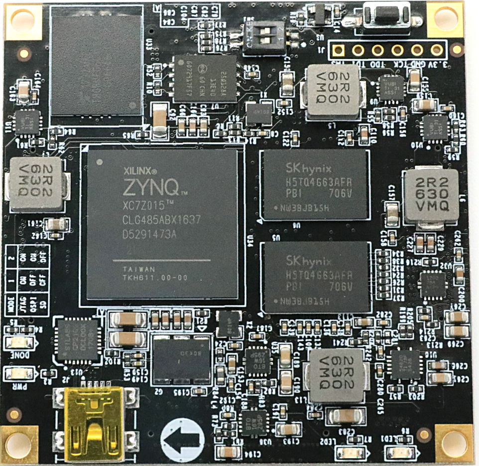

AC7015B核心板正面图

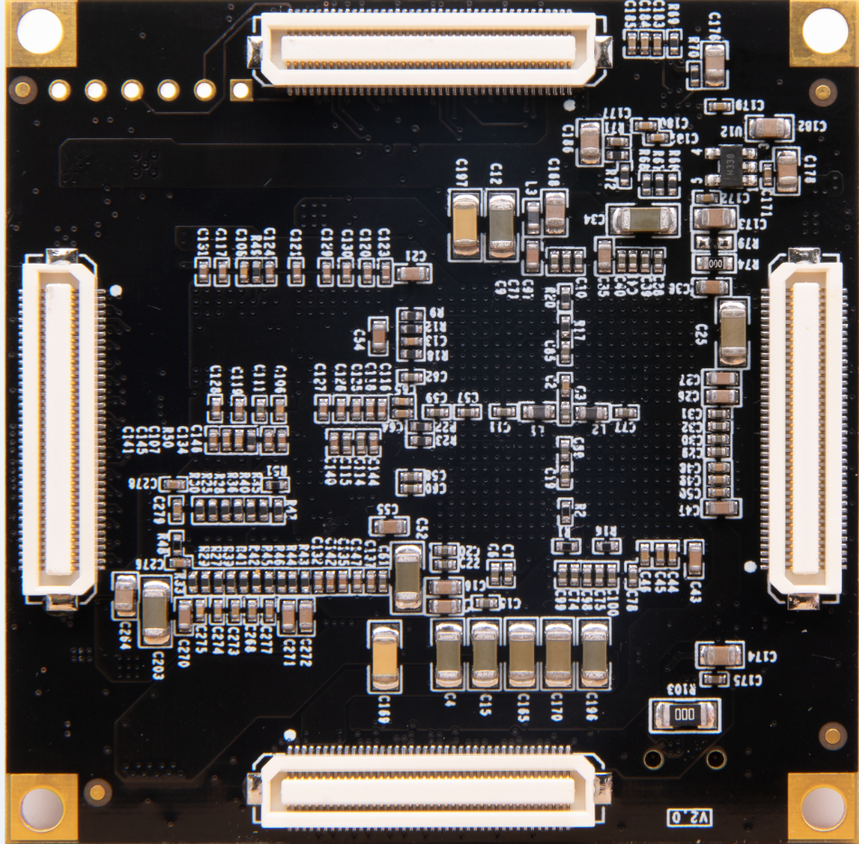

AC7015B核心板背面图

ZYNQ芯片
--------

开发板使用的是Xilinx公司的Zynq7000系列的芯片，型号为XC7Z015-2CLG485I。芯片的PS系统集成了两个ARM
Cortex™-A9处理器，AMBA®互连，内部存储器，外部存储器接口和外设。这些外设主要包括USB总线接口，以太网接口，SD/SDIO接口，I2C总线接口，CAN总线接口，UART接口，GPIO等。PS可以独立运行并在上电或复位下启动。ZYNQ7000芯片的总体框图如图2-2-1所示

.. image:: images/media/image6.png

图2-2-1 ZYNQ7000芯片的总体框图

其中PS系统部分的主要参数如下：

-  基于ARM 双核CortexA9 的应用处理器，ARM-v7架构 高达766MHz

-  每个CPU 32KB 1级指令和数据缓存，512KB 2级缓存 2个CPU共享

-  片上boot ROM和256KB 片内RAM

-  外部存储接口，支持16/32 bit DDR2、DDR3接口

-  两个千兆网卡支持：发散-聚集DMA ，GMII，RGMII，SGMII接口

-  两个USB2.0 OTG接口，每个最多支持12节点

-  两个CAN2.0B总线接口

-  两个SD卡、SDIO、MMC兼容控制器

-  2个SPI，2个UARTs，2个I2C接口

-  4组32bit GPIO，54（32+22）作为PS系统IO，64连接到PL

-  PS内和PS到PL的高带宽连接

其中PL逻辑部分的主要参数如下：

-  逻辑单元Logic Cells：74K；

-  查找表LUTs: 46,200

-  触发器(flip-flops):92,400

-  乘法器18x25MACCs：160;

-  Block RAM：3.3Mb；

-  4路高速GTP收发器，支持PCIE Gen2x4；

-  2个AD转换器,可以测量片上电压、温度感应和高达17外部差分输入通道，1MBPS

XC7Z015-2CLG485I芯片的速度等级为-2，工业级，封装为BGA484，引脚间距为0.8mm，ZYNQ7000系列的具体的芯片型号定义如下图2-2-2所示。

.. image:: images/media/image7.png

图2-2-2 ZYNQ型号命名规则定义

DDR3 DRAM
---------

AC7015B核心板上配有两片SK Hynix公司的DDR3
SDRAM芯片(共计1GB),型号为H5TQ4G63AFR-PBI（兼容美光的MT41J256M16RE-125）。DDR3
SDRAM的总线宽度共为32bit。DDR3
SDRAM的最高运行速度可达533MHz(数据速率1066Mbps)。该DDR3存储系统直接连接到了ZYNQ处理系统（PS）的BANK
502的存储器接口上。DDR3 SDRAM的具体配置如下表2-3-1所示。

表5-1 DDR3 SDRAM配置

+--------------+--------------------+------------------+--------------+
| **位号**     | **芯片型号**       | **容量**         | **厂家**     |
+--------------+--------------------+------------------+--------------+
| U5,U6        | H5TQ4G63AFR-PBI    | 256M x 16bit     | SK Hynix     |
+--------------+--------------------+------------------+--------------+

DDR3的硬件设计需要严格考虑信号完整性，我们在电路设计和PCB设计的时候已经充分考虑了匹配电阻/终端电阻,走线阻抗控制，走线等长控制，　保证DDR3的高速稳定的工作。

DDR3 DRAM的硬件连接方式如图2-3-1所示:

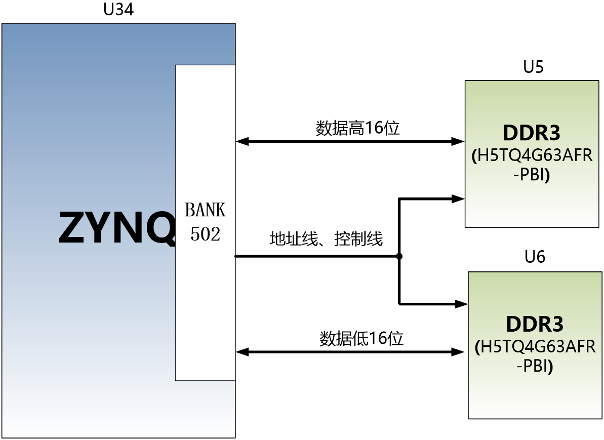

图2-3-1 DDR3 DRAM原理图部分

**DDR3 DRAM引脚分配：**

+-----------------------+---------------------+------------------------+
| **信号名称**          | **ZYNQ引脚名**      | **ZYNQ引脚号**         |
+-----------------------+---------------------+------------------------+
| **DDR3_DQS0_P**       | PS_DDR_DQS_P0_502   | C21                    |
+-----------------------+---------------------+------------------------+
| **DDR3_DQS0_N**       | PS_DDR_DQS_N0_502   | D21                    |
+-----------------------+---------------------+------------------------+
| **DDR3_DQS1_P**       | PS_DDR_DQS_P1_502   | H21                    |
+-----------------------+---------------------+------------------------+
| **DDR3_DQS1_N**       | PS_DDR_DQS_N1_502   | J21                    |
+-----------------------+---------------------+------------------------+
| **DDR3_DQS2_P**       | PS_DDR_DQS_P2_502   | N21                    |
+-----------------------+---------------------+------------------------+
| **DDR3_DQS2_N**       | PS_DDR_DQS_N2_502   | P21                    |
+-----------------------+---------------------+------------------------+
| **DDR3_DQS3_P**       | PS_DDR_DQS_P3_502   | V21                    |
+-----------------------+---------------------+------------------------+
| **DDR3_DQS4_N**       | PS_DDR_DQS_N3_502   | W21                    |
+-----------------------+---------------------+------------------------+
| **DDR3_D0**           | PS_DDR_DQ0_502      | D22                    |
+-----------------------+---------------------+------------------------+
| **DDR3_D1**           | PS_DDR_DQ1_502      | C20                    |
+-----------------------+---------------------+------------------------+
| **DDR3_D2**           | PS_DDR_DQ2_502      | B21                    |
+-----------------------+---------------------+------------------------+
| **DDR3_D3**           | PS_DDR_DQ3_502      | D20                    |
+-----------------------+---------------------+------------------------+
| **DDR3_D4**           | PS_DDR_DQ4_502      | E20                    |
+-----------------------+---------------------+------------------------+
| **DDR3_D5**           | PS_DDR_DQ5_502      | E22                    |
+-----------------------+---------------------+------------------------+
| **DDR3_D6**           | PS_DDR_DQ6_502      | F21                    |
+-----------------------+---------------------+------------------------+
| **DDR3_D7**           | PS_DDR_DQ7_502      | F22                    |
+-----------------------+---------------------+------------------------+
| **DDR3_D8**           | PS_DDR_DQ8_502      | G21                    |
+-----------------------+---------------------+------------------------+
| **DDR3_D9**           | PS_DDR_DQ9_502      | G22                    |
+-----------------------+---------------------+------------------------+
| **DDR3_D10**          | PS_DDR_DQ10_502     | L22                    |
+-----------------------+---------------------+------------------------+
| **DDR3_D11**          | PS_DDR_DQ11_502     | L21                    |
+-----------------------+---------------------+------------------------+
| **DDR3_D12**          | PS_DDR_DQ12_502     | L20                    |
+-----------------------+---------------------+------------------------+
| **DDR3_D13**          | PS_DDR_DQ13_502     | K22                    |
+-----------------------+---------------------+------------------------+
| **DDR3_D14**          | PS_DDR_DQ14_502     | J22                    |
+-----------------------+---------------------+------------------------+
| **DDR3_D15**          | PS_DDR_DQ15_502     | K20                    |
+-----------------------+---------------------+------------------------+
| **DDR3_D16**          | PS_DDR_DQ16_502     | M22                    |
+-----------------------+---------------------+------------------------+
| **DDR3_D17**          | PS_DDR_DQ17_502     | T20                    |
+-----------------------+---------------------+------------------------+
| **DDR3_D18**          | PS_DDR_DQ18_502     | N20                    |
+-----------------------+---------------------+------------------------+
| **DDR3_D19**          | PS_DDR_DQ19_502     | T22                    |
+-----------------------+---------------------+------------------------+
| **DDR3_D20**          | PS_DDR_DQ20_502     | R20                    |
+-----------------------+---------------------+------------------------+
| **DDR3_D21**          | PS_DDR_DQ21_502     | T21                    |
+-----------------------+---------------------+------------------------+
| **DDR3_D22**          | PS_DDR_DQ22_502     | M21                    |
+-----------------------+---------------------+------------------------+
| **DDR3_D23**          | PS_DDR_DQ23_502     | R22                    |
+-----------------------+---------------------+------------------------+
| **DDR3_D24**          | PS_DDR_DQ24_502     | Y20                    |
+-----------------------+---------------------+------------------------+
| **DDR3_D25**          | PS_DDR_DQ25_502     | U22                    |
+-----------------------+---------------------+------------------------+
| **DDR3_D26**          | PS_DDR_DQ26_502     | AA22                   |
+-----------------------+---------------------+------------------------+
| **DDR3_D27**          | PS_DDR_DQ27_502     | U21                    |
+-----------------------+---------------------+------------------------+
| **DDR3_D28**          | PS_DDR_DQ28_502     | W22                    |
+-----------------------+---------------------+------------------------+
| **DDR3_D29**          | PS_DDR_DQ29_502     | W20                    |
+-----------------------+---------------------+------------------------+
| **DDR3_D30**          | PS_DDR_DQ30_502     | V20                    |
+-----------------------+---------------------+------------------------+
| **DDR3_D31**          | PS_DDR_DQ31_502     | Y22                    |
+-----------------------+---------------------+------------------------+
| **DDR3_DM0**          | PS_DDR_DM0_502      | B22                    |
+-----------------------+---------------------+------------------------+
| **DDR3_DM1**          | PS_DDR_DM1_502      | H20                    |
+-----------------------+---------------------+------------------------+
| **DDR3_DM2**          | PS_DDR_DM2_502      | P22                    |
+-----------------------+---------------------+------------------------+
| **DDR3_DM3**          | PS_DDR_DM3_502      | AA21                   |
+-----------------------+---------------------+------------------------+
| **DDR3_A0**           | PS_DDR_A0_502       | M19                    |
+-----------------------+---------------------+------------------------+
| **DDR3_A1**           | PS_DDR_A1_502       | M18                    |
+-----------------------+---------------------+------------------------+
| **DDR3_A2**           | PS_DDR_A2_502       | K19                    |
+-----------------------+---------------------+------------------------+
| **DDR3_A3**           | PS_DDR_A3_502       | L19                    |
+-----------------------+---------------------+------------------------+
| **DDR3_A4**           | PS_DDR_A4_502       | K17                    |
+-----------------------+---------------------+------------------------+
| **DDR3_A5**           | PS_DDR_A5_502       | K18                    |
+-----------------------+---------------------+------------------------+
| **DDR3_A6**           | PS_DDR_A6_502       | J16                    |
+-----------------------+---------------------+------------------------+
| **DDR3_A7**           | PS_DDR_A7_502       | J17                    |
+-----------------------+---------------------+------------------------+
| **DDR3_A8**           | PS_DDR_A8_502       | J18                    |
+-----------------------+---------------------+------------------------+
| **DDR3_A9**           | PS_DDR_A9_502       | H18                    |
+-----------------------+---------------------+------------------------+
| **DDR3_A10**          | PS_DDR_A10_502      | J20                    |
+-----------------------+---------------------+------------------------+
| **DDR3_A11**          | PS_DDR_A11_502      | G18                    |
+-----------------------+---------------------+------------------------+
| **DDR3_A12**          | PS_DDR_A12_502      | H19                    |
+-----------------------+---------------------+------------------------+
| **DDR3_A13**          | PS_DDR_A13_502      | F19                    |
+-----------------------+---------------------+------------------------+
| **DDR3_A14**          | PS_DDR_A14_502      | G19                    |
+-----------------------+---------------------+------------------------+
| **DDR3_BA0**          | PS_DDR_BA0_502      | L16                    |
+-----------------------+---------------------+------------------------+
| **DDR3_BA1**          | PS_DDR_BA1_502      | L17                    |
+-----------------------+---------------------+------------------------+
| **DDR3_BA2**          | PS_DDR_BA2_502      | M17                    |
+-----------------------+---------------------+------------------------+
| **DDR3_S0**           | PS_DDR_CS_B_502     | P17                    |
+-----------------------+---------------------+------------------------+
| **DDR3_RAS**          | PS_DDR_RAS_B_502    | R18                    |
+-----------------------+---------------------+------------------------+
| **DDR3_CAS**          | PS_DDR_CAS_B_502    | P20                    |
+-----------------------+---------------------+------------------------+
| **DDR3_WE**           | PS_DDR_WE_B_502     | R19                    |
+-----------------------+---------------------+------------------------+
| **DDR3_ODT**          | PS_DDR_ODT_502      | P18                    |
+-----------------------+---------------------+------------------------+
| **DDR3_RESET**        | PS_DDR_DRST_B_502   | F20                    |
+-----------------------+---------------------+------------------------+
| **DDR3_CLK0_P**       | PS_DDR_CKP_502      | N19                    |
+-----------------------+---------------------+------------------------+
| **DDR3_CLK0_N**       | PS_DDR_CKN_502      | N18                    |
+-----------------------+---------------------+------------------------+
| **DDR3_CKE**          | PS_DDR_CKE_502      | T19                    |
+-----------------------+---------------------+------------------------+

QSPI Flash
----------

核心板配有一片256MBit大小的Quad-SPI
FLASH芯片，型号为W25Q256FVEI，它使用3.3V CMOS电压标准。由于QSPI
FLASH的非易失特性，在使用中，
它可以作为系统的启动设备来存储系统的启动镜像。这些镜像主要包括FPGA的bit文件、ARM的应用程序代码以及其它的用户数据文件。QSPI
FLASH的具体型号和相关参数见表2-4-1。

+--------------+--------------------+------------------+--------------+
| **位号**     | **芯片类型**       | **容量**         | **厂家**     |
+--------------+--------------------+------------------+--------------+
| U7           | W25Q256FVEI        | 32M Byte         | Winbond      |
+--------------+--------------------+------------------+--------------+

表2-4-1 QSPI Flash的型号和参数

QSPI
FLASH连接到ZYNQ芯片的PS部分BANK500的GPIO口上，在系统设计中需要配置这些PS端的GPIO口功能为QSPI
FLASH接口。为图2-4-1为QSPI Flash在原理图中的部分。

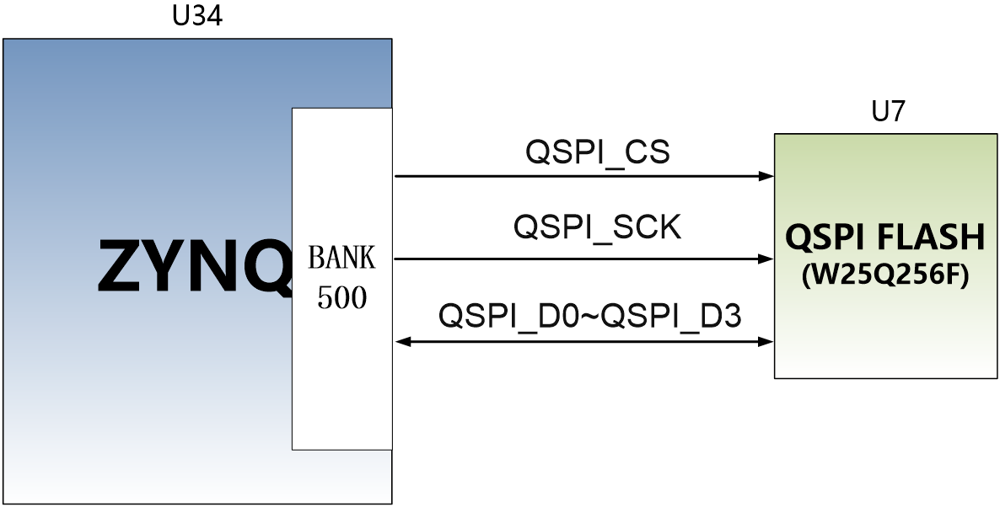

图2-4-1 QSPI Flash连接示意图

**配置芯片引脚分配：**

+-----------------------------+------------------+---------------------+
| **信号名称**                | **ZYNQ引脚名**   | **ZYNQ引脚号**      |
+-----------------------------+------------------+---------------------+
| **QSPI_SCK**                | PS_MIO6_500      | A19                 |
+-----------------------------+------------------+---------------------+
| **QSPI_CS**                 | PS_MIO1_500      | A22                 |
+-----------------------------+------------------+---------------------+
| **QSPI_D0**                 | PS_MIO2_500      | A21                 |
+-----------------------------+------------------+---------------------+
| **QSPI_D1**                 | PS_MIO3_500      | F17                 |
+-----------------------------+------------------+---------------------+
| **QSPI_D2**                 | PS_MIO4_500      | E19                 |
+-----------------------------+------------------+---------------------+
| **QSPI_D3**                 | PS_MIO5_500      | A20                 |
+-----------------------------+------------------+---------------------+

eMMC Flash
----------

核心板配有一片大容量的8GB大小的eMMC
FLASH芯片，型号为MTFC4GACAAAM-1M，它支持JEDEC e-MMC
V5.0标准的HS-MMC接口，电平支持1.8V或者3.3V。eMMC
FLASH和ZYNQ连接的数据宽度为4bit。由于eMMC
FLASH的大容量和非易失特性，在ZYNQ系统使用中，它可以作为系统大容量的存储设备，比如存储ARM的应用程序、系统文件以及其它的用户数据文件。eMMC
FLASH的具体型号和相关参数见表2-5-1。

+--------------+---------------------+------------------+--------------+
| **位号**     | **芯片类型**        | **容量**         | **厂家**     |
+--------------+---------------------+------------------+--------------+
| U33          | MTFC4GACAAAM-1M     | 8G Byte          | Micron       |
+--------------+---------------------+------------------+--------------+

表2-5-1 eMMC Flash的型号和参数

eMMC
FLASH连接到ZYNQ芯片的PS部分BANK501的GPIO口上，在系统设计中需要配置这些PS端的GPIO口功能为SD接口。为图2-5-1为eMMC
Flash在原理图中的部分。

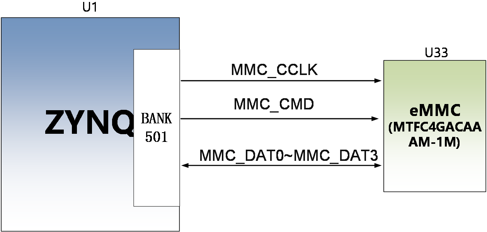

图2-5-1 eMMC Flash连接示意图

**配置芯片引脚分配：**

+-----------------------------+------------------+---------------------+
| **信号名称**                | **ZYNQ引脚名**   | **ZYNQ引脚号**      |
+-----------------------------+------------------+---------------------+
| **MMC_CCLK**                | PS_MIO48_501     | D12                 |
+-----------------------------+------------------+---------------------+
| **MMC_CMD**                 | PS_MIO47_501     | B13                 |
+-----------------------------+------------------+---------------------+
| **MMC_D0**                  | PS_MIO46_501     | D11                 |
+-----------------------------+------------------+---------------------+
| **MMC_D1**                  | PS_MIO49_501     | C9                  |
+-----------------------------+------------------+---------------------+
| **MMC_D2**                  | PS_MIO50_501     | D10                 |
+-----------------------------+------------------+---------------------+
| **MMC_D3**                  | PS_MIO51_501     | C13                 |
+-----------------------------+------------------+---------------------+

时钟配置
--------

AC7015B核心板上分别为PS系统，PL逻辑部分和GTP收发器提供了有源时钟，使PS系统，PL逻辑和GTP收发器可以单独工作。其中PS和PL端使用单端晶振，GTP端使用差分晶振。

**PS系统时钟源**

ZYNQ芯片通过开发板上的X1晶振为PS部分提供33.333MHz的时钟输入。时钟的输入连接到ZYNQ芯片的BANK500的PS_CLK_500的管脚上。其原理图如图2-6-1所示：

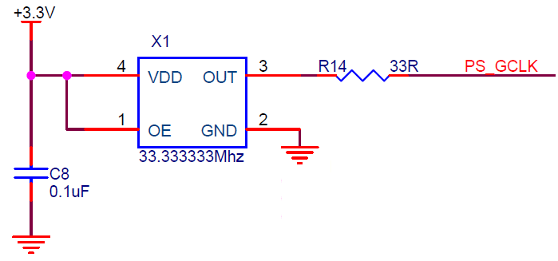

图2-6-1 PS部分的有源晶振

时钟引脚分配：

+-----------------------------------+-----------------------------------+
| **信号名称**                      | **ZYNQ引脚**                      |
+-----------------------------------+-----------------------------------+
| **PS_GCLK**                       | **F16**                           |
+-----------------------------------+-----------------------------------+

**PL系统时钟源**

AC7015B核心板上提供了单端50MHz的PL系统时钟源，3.3V供电。晶振输出连接到FPGA
BANK13的全局时钟(MRCC)，这个GCLK可以用来驱动FPGA内的用户逻辑电路。该时钟源的原理图如图2-6-3所示

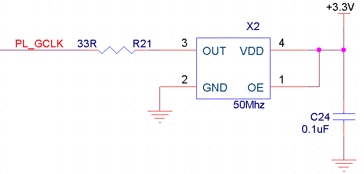

图 2-6-3 PL系统时钟源

PL时钟引脚分配：

+-----------------------------------+-----------------------------------+
| **信号名称**                      | **ZYNQ引脚**                      |
+-----------------------------------+-----------------------------------+
| **PL_GCLK**                       | **Y14**                           |
+-----------------------------------+-----------------------------------+

**GTP差分时钟**

AC7015B核心板上提供了差分125MHz的GTP参考时钟。差分LVDS时钟输出连接到BANK112的参考时钟上，这个125Mhz的时钟可以用来作为底板的光纤数据通信的参考时钟。该时钟源的原理图如图2-6-5所示

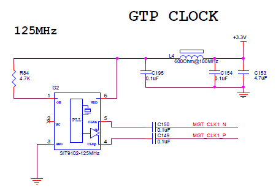

图 2-6-5 GTP参考时钟

图2-6-6为差分晶振125MHz的实物图

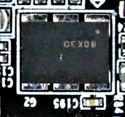

图2-6-6 125Mhz差分晶振实物图

GTP时钟引脚分配：

+-----------------------------------+-----------------------------------+
| **信号名称**                      | **ZYNQ引脚**                      |
+-----------------------------------+-----------------------------------+
| MGT_CLK1_P                        | U5                                |
+-----------------------------------+-----------------------------------+
| MGT_CLK1_N                        | V5                                |
+-----------------------------------+-----------------------------------+

USB转串口
---------

为了AC7015B核心板单独工作和调试，
我们为核心板配备了一个Uart转USB接口。用于核心板单独供电和调试。转换芯片采用Silicon
Labs CP2102GM的USB-UAR芯片, USB接口采用MINI
USB接口，可以用一根USB线将它连接到上PC的USB口进行核心板的单独供电和串口数据通信
。

USB Uart电路设计的示意图如下图所示:

.. image:: images/media/image15.png

2-7-1 USB转串口示意图

**UART转串口的ZYNQ引脚分配：**

+---------------+--------------+------------+-------------------------+
| **信号名称**  | **ZY         | **ZY       | **备注**                |
|               | NQ引脚名**   | NQ引脚号** |                         |
+---------------+--------------+------------+-------------------------+
| UART_RXD      | PS_MIO14_500 | B17        | Uart数据输入            |
+---------------+--------------+------------+-------------------------+
| UART_TXD      | PS_MIO15_500 | E17        | Uart数据输出            |
+---------------+--------------+------------+-------------------------+

LED灯
-----

AC7015B核心板上有4个红色LED灯，其中1个是电源指示灯(PWR)，1个是配置LED灯(DONE)，2个是用户LED灯（LED1~LED2）。当核心板供电后，电源指示灯会亮起；当FPGA
配置程序后，配置LED灯会亮起。2个用户LED灯一个连接到PS的MIO上，一个连接到PL的IO上，用户可以通过程序来控制亮和灭，当连接用户LED灯的IO电压为高时，用户LED灯熄灭，当连接IO电压为低时，用户LED会被点亮。LED灯硬件连接的示意图如图2-8-1所示：

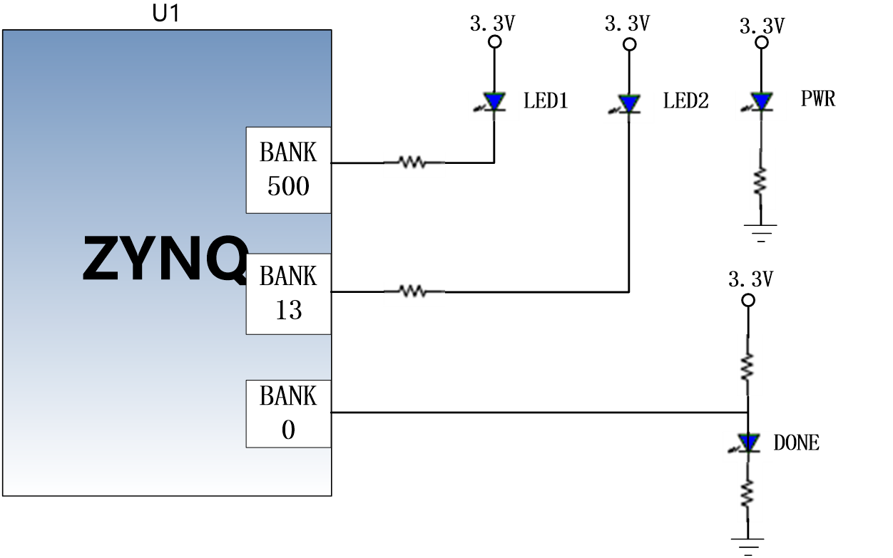

图2-8-1 核心板LED灯硬件连接示意图

**用户LED灯的引脚分配**

+--------------+------------------+--------------+--------------------+
| **信号名称** | **ZYNQ引脚名**   | **ZY         | **备注**           |
|              |                  | NQ管脚号**   |                    |
+--------------+------------------+--------------+--------------------+
| MIO0_LED     | PS_MIO0_500      | G17          | 用户LED1灯         |
+--------------+------------------+--------------+--------------------+
| PL_LED       | IO_0_13          | T16          | 用户LED2灯         |
+--------------+------------------+--------------+--------------------+

复位按键
--------

AC7015B核心板上有一个复位按键RESET和电路，复位信号连接到ZYNQ芯片PS复位管脚上，用户可以使用这个复位按键来复位ZYNQ系统。复位按键按下，复位芯片会产生低电平的复位信号给ZYNQ芯片。
复位按键和复位芯片连接的示意图如图2-9-1所示：

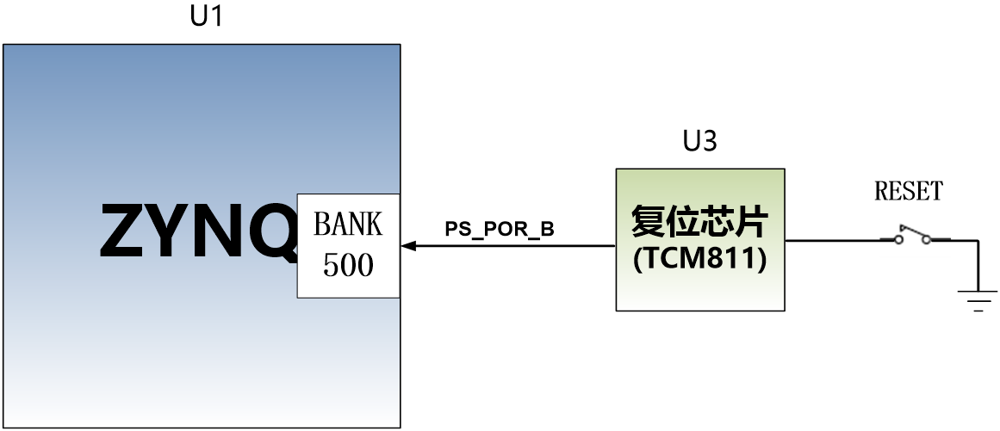

图2-9-1 复位按键连接示意图

**复位按键的ZYNQ管脚分配**

+---------------+---------------+------------+------------------------+
| **信号名称**  | **ZY          | **ZY       | **备注**               |
|               | NQ引脚名**    | NQ引脚号** |                        |
+---------------+---------------+------------+------------------------+
| PS_POR_B      | PS_POR_B_500  | B18        | ZYNQ系统复位信号       |
+---------------+---------------+------------+------------------------+

JTAG接口
--------

在AC7015B核心板上我们也预留了JTAG的测试座J1，用来核心板单独JTAG下载和调试，图2-10-1就是JTAG口的原理图部分，其中涉及到TMS,TDI,TDO,TCK,GND,+3.3V这六个信号。

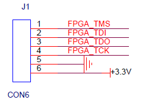

图2-10-1 核心板原理图中JTAG接口部分

核心板上JTAG接口J1采用6针的2.54mm间距的单排测试孔，用户如果需要在核心板上用JTAG连接调试的话，需要焊接6针的单排排针。图2-10-2为JTAG接口在开发板上的实物图

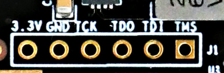

图2-10-2 JTAG接口实物图

拨码开关配置
------------

AC7015B核心板上有一个2位的拨码开关SW1用来配置ZYNQ系统的启动模式。AC7015B系统开发平台支持三种启动模式。这三种启动模式分别是JTAG调试模式,
QSPI
FLASH和SD卡启动模式。XC7Z015芯片上电后会检测响应MIO口（MIO5和MIO4）的电平来决定那种启动模式。用户可以通过核心板上的拨码开关SW1来选择不同的启动模式。SW1启动模式配置如下表2-11-1所示。

+-------------------+----------------+----------------+----------------+
| **SW1**           | **拨码         | **M            | **启动模式**   |
|                   | 位置（1，2）** | IO5,MIO4电平** |                |
+-------------------+----------------+----------------+----------------+
| |image2|          | ON、ON         | 0、0           | JTAG           |
+-------------------+----------------+----------------+----------------+
|                   | OFF、OFF       | 1、1           | SD卡           |
+-------------------+----------------+----------------+----------------+
|                   | OFF、ON        | 1、0           | QSPI FLASH     |
+-------------------+----------------+----------------+----------------+

表2-11-1 SW1启动模式配置

电源
----

AC7015B核心板供电电压为DC5V，单独使用时通过Mini
USB接口供电，连接底板时通过底板供电，请注意不要Mini
USB和底板同时供电，以免造成损坏。板上的电源设计示意图如下图2-12-1所示:

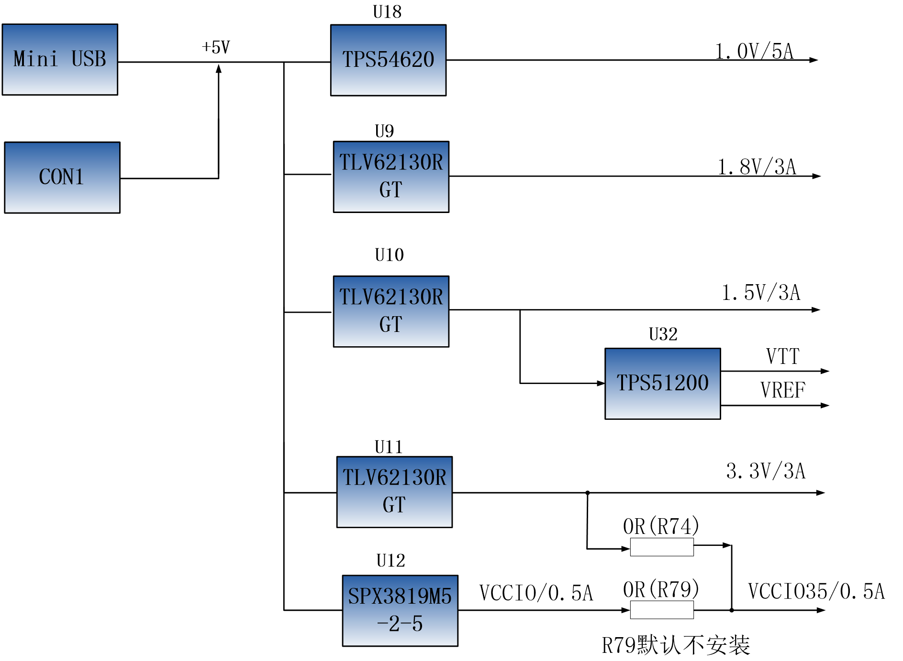

图2-12-1原理图中电源接口部分

开发板通过+5V供电,
通过四路DC/DC电源芯片TPS54620和TLV62130RGT转化成+1.0V，+1.8V，+1.5V，+3.3V四路电源，+1.0V输出电流可高达5A，
其它3路电源电流为3A。另外通过一路LDO SPX3819M5-2-5产生VCCIO
2.5V电源，VCCIO
2.5V电源主要是预留给FPGA的BANK35的BANK电源，用户可以通过2个0欧姆电阻(R74,R79)来选择BANK35的电源。默认开发板上R74是安装的，R79的电阻是不安装的，所以BANK35的电源是+3.3V的。用户可以通过更换电阻，使得BANK35的IO输入输出为2.5V的电压标准。1.5V通过TI的TPS51200生成DDR3需要的VTT和VREF电压。各个电源分配的功能如下表所示：

+----------------------+-----------------------------------------------+
| **电源**             | **功能**                                      |
+----------------------+-----------------------------------------------+
| +1.0V                | ZYNQ PS和PL部分的内核电压                     |
+----------------------+-----------------------------------------------+
| +1.8V                | ZYNQ PS和PL部分辅助电压，BANK501 IO电压，eMMC |
+----------------------+-----------------------------------------------+
| +3.3V                | ZYNQ Bank0,Bank500，Bank13，Bank34的VCCIO,    |
|                      | QSIP FLASH, Clock晶振                         |
+----------------------+-----------------------------------------------+
| +1.5V                | DDR3, ZYNQ Bank501                            |
+----------------------+-----------------------------------------------+
| VREF, VTT（+0.75V）  | DDR3                                          |
+----------------------+-----------------------------------------------+
| VCCIO(+2.5V)         | 预留为ZYNQ Bank35                             |
+----------------------+-----------------------------------------------+

因为ZYNQ FPGA的电源有上电顺序的要求，在电路设计中，我们已经按照
芯片的电源要求设计，上电依次为+1.0V->+1.8V->（+1.5
V、+3.3V、VCCIO）的电路设计，保证芯片的正常工作。

结构图
------

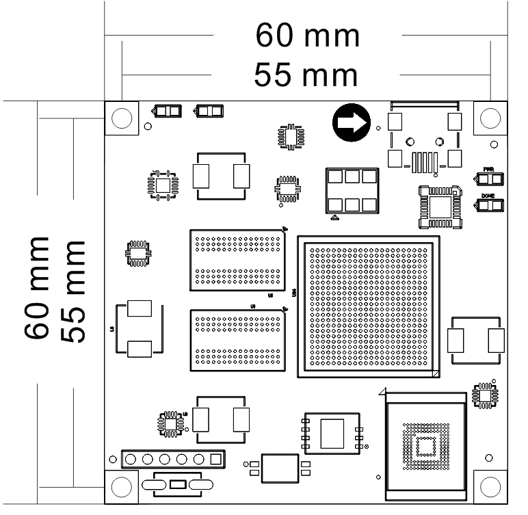

正面图（Top View）

连接器管脚定义
--------------

核心板一共扩展出4个高速扩展口，使用4个80Pin的板间连接器（CON1~CON4）和底板连接，连接器的PIN脚间距为0.5mm。其中CON1连接电源输入，PS的MIO信号和JTAG信号，CON2~CON4连接PL的BANK13，BANK34，
BANK35的IO信号和GTP的收发器信号。
BANK35的IO电平可以通过更换板上的LDO芯片（U12）来改变电平标准，默认是3.3V。

**CON1连接器的引脚分配**

+----------+----------+----------+----------+-------------+----------+
| **CO     | **信     | **ZYNQ   | **CO     | **信        | **ZYNQ   |
| N1管脚** | 号名称** | 引脚号** | N1管脚** | 号名称**    | 引脚号** |
+----------+----------+----------+----------+-------------+----------+
| 1        | +5V      | -        | 2        | +5V         | -        |
+----------+----------+----------+----------+-------------+----------+
| 3        | +5V      | -        | 4        | +5V         | -        |
+----------+----------+----------+----------+-------------+----------+
| 5        | +5V      | -        | 6        | +5V         | -        |
+----------+----------+----------+----------+-------------+----------+
| 7        | +5V      | -        | 8        | +5V         | -        |
+----------+----------+----------+----------+-------------+----------+
| 9        | GND      | -        | 10       | GND         | -        |
+----------+----------+----------+----------+-------------+----------+
| 11       | PS_MIO13 | A17      | 12       | ETH_TXD0    | E14      |
+----------+----------+----------+----------+-------------+----------+
| 13       | PS_MIO12 | C18      | 14       | ETH_TXD1    | A16      |
+----------+----------+----------+----------+-------------+----------+
| 15       | -        | -        | 16       | ETH_TXD2    | E13      |
+----------+----------+----------+----------+-------------+----------+
| 17       | -        | -        | 18       | ETH_TXD3    | A15      |
+----------+----------+----------+----------+-------------+----------+
| 19       | GND      | -        | 20       | GND         | -        |
+----------+----------+----------+----------+-------------+----------+
| 21       | -        | -        | 22       | ETH_TXCK    | D17      |
+----------+----------+----------+----------+-------------+----------+
| 23       | -        | -        | 24       | ETH_TXCTL   | F12      |
+----------+----------+----------+----------+-------------+----------+
| 25       | -        | -        | 26       | ETH_RXD3    | A10      |
+----------+----------+----------+----------+-------------+----------+
| 27       | -        | -        | 28       | ETH_RXD2    | F11      |
+----------+----------+----------+----------+-------------+----------+
| 29       | GND      | -        | 30       | GND         | -        |
+----------+----------+----------+----------+-------------+----------+
| 31       | PS_MIO7  | D18      | 32       | ETH_RXD1    | B16      |
+----------+----------+----------+----------+-------------+----------+
| 33       | PS_MIO8  | E18      | 34       | ETH_RXD0    | E12      |
+----------+----------+----------+----------+-------------+----------+
| 35       | PS_MIO9  | C19      | 36       | ETH_RXCTL   | D16      |
+----------+----------+----------+----------+-------------+----------+
| 37       | PS_MIO11 | B19      | 38       | ETH_RXCK    | A9       |
+----------+----------+----------+----------+-------------+----------+
| 39       | GND      | -        | 40       | GND         | -        |
+----------+----------+----------+----------+-------------+----------+
| 41       | -        | -        | 42       | ETH_MDC     | D13      |
+----------+----------+----------+----------+-------------+----------+
| 43       | -        | -        | 44       | ETH_MDIO    | C11      |
+----------+----------+----------+----------+-------------+----------+
| 45       | -        | -        | 46       | OTG_STP     | A12      |
+----------+----------+----------+----------+-------------+----------+
| 47       | -        | -        | 48       | OTG_DIR     | E15      |
+----------+----------+----------+----------+-------------+----------+
| 49       | GND      | -        | 50       | GND         | -        |
+----------+----------+----------+----------+-------------+----------+
| 51       | XADC_VP  | L12      | 52       | OTG_CLK     | A14      |
+----------+----------+----------+----------+-------------+----------+
| 53       | XADC_VN  | M11      | 54       | OTG_NXT     | F14      |
+----------+----------+----------+----------+-------------+----------+
| 55       | -        | -        | 56       | OTG_DATA0   | C16      |
+----------+----------+----------+----------+-------------+----------+
| 57       | PS_MIO10 | G16      | 58       | OTG_DATA1   | G11      |
+----------+----------+----------+----------+-------------+----------+
| 59       | GND      | -        | 60       | GND         | -        |
+----------+----------+----------+----------+-------------+----------+
| 61       | SD_CLK   | E9       | 62       | OTG_DATA2   | B11      |
+----------+----------+----------+----------+-------------+----------+
| 63       | SD_D1    | B12      | 64       | OTG_DATA3   | F9       |
+----------+----------+----------+----------+-------------+----------+
| 65       | SD_D0    | D15      | 66       | OTG_DATA4   | A11      |
+----------+----------+----------+----------+-------------+----------+
| 67       | SD_CMD   | C15      | 68       | OTG_DATA5   | B9       |
+----------+----------+----------+----------+-------------+----------+
| 69       | GND      | -        | 70       | GND         | -        |
+----------+----------+----------+----------+-------------+----------+
| 71       | SD_D3    | B14      | 72       | OTG_DATA6   | F10      |
+----------+----------+----------+----------+-------------+----------+
| 73       | SD_D2    | E10      | 74       | OTG_DATA7   | C10      |
+----------+----------+----------+----------+-------------+----------+
| 75       | -        | -        | 76       | -           | -        |
+----------+----------+----------+----------+-------------+----------+
| 77       | FPGA_TMS | H10      | 78       | FPGA_TCK    | H11      |
+----------+----------+----------+----------+-------------+----------+
| 79       | FPGA_TDO | G9       | 80       | FPGA_TDI    | H9       |
+----------+----------+----------+----------+-------------+----------+

**CON2连接器的引脚分配**

+----------+----------+----------+----------+-------------+----------+
| **CO     | **信     | **ZYNQ   | **CO     | **信        | **ZYNQ   |
| N2管脚** | 号名称** | 引脚号** | N2管脚** | 号名称**    | 引脚号** |
+----------+----------+----------+----------+-------------+----------+
| 1        | B        | N5       | 2        | B34_L13_N   | T1       |
|          | 34_L19_N |          |          |             |          |
+----------+----------+----------+----------+-------------+----------+
| 3        | B        | N6       | 4        | B34_L13_P   | T2       |
|          | 34_L19_P |          |          |             |          |
+----------+----------+----------+----------+-------------+----------+
| 5        | B34_L2_P | J7       | 6        | B34_L21_N   | N3       |
+----------+----------+----------+----------+-------------+----------+
| 7        | B34_L2_N | J6       | 8        | B34_L21_P   | N4       |
+----------+----------+----------+----------+-------------+----------+
| 9        | GND      | -        | 10       | GND         | -        |
+----------+----------+----------+----------+-------------+----------+
| 11       | B34_L1_P | J8       | 12       | B34_L12_N   | L4       |
+----------+----------+----------+----------+-------------+----------+
| 13       | B34_L1_N | K8       | 14       | B34_L12_P   | L5       |
+----------+----------+----------+----------+-------------+----------+
| 15       | B        | K3       | 16       | B35_L4_P    | G8       |
|          | 34_L11_N |          |          |             |          |
+----------+----------+----------+----------+-------------+----------+
| 17       | B        | K4       | 18       | B35_L4_N    | G7       |
|          | 34_L11_P |          |          |             |          |
+----------+----------+----------+----------+-------------+----------+
| 19       | GND      | -        | 20       | GND         | -        |
+----------+----------+----------+----------+-------------+----------+
| 21       | B        | H1       | 22       | B35_L19_P   | H4       |
|          | 35_L24_P |          |          |             |          |
+----------+----------+----------+----------+-------------+----------+
| 23       | B        | G1       | 24       | B35_L19_N   | H3       |
|          | 35_L24_N |          |          |             |          |
+----------+----------+----------+----------+-------------+----------+
| 25       | B34_L8_N | J1       | 26       | B35_L22_P   | G3       |
+----------+----------+----------+----------+-------------+----------+
| 27       | B34_L8_P | J2       | 28       | B35_L22_N   | G2       |
+----------+----------+----------+----------+-------------+----------+
| 29       | GND      | -        | 30       | GND         | -        |
+----------+----------+----------+----------+-------------+----------+
| 31       | B35_IO25 | H5       | 32       | B35_L21_P   | E4       |
+----------+----------+----------+----------+-------------+----------+
| 33       | B35_IO0  | H6       | 34       | B35_L21_N   | E3       |
+----------+----------+----------+----------+-------------+----------+
| 35       | B        | G4       | 36       | B35_L2_P    | D7       |
|          | 35_L20_P |          |          |             |          |
+----------+----------+----------+----------+-------------+----------+
| 37       | B        | F4       | 38       | B35_L2_N    | D6       |
|          | 35_L20_N |          |          |             |          |
+----------+----------+----------+----------+-------------+----------+
| 39       | GND      | -        | 40       | GND         | -        |
+----------+----------+----------+----------+-------------+----------+
| 41       | B35_L5_P | F5       | 42       | B35_L23_P   | F2       |
+----------+----------+----------+----------+-------------+----------+
| 43       | B35_L5_N | E5       | 44       | B35_L23_N   | F1       |
+----------+----------+----------+----------+-------------+----------+
| 45       | B35_L6_P | G6       | 46       | B35_L17_P   | E2       |
+----------+----------+----------+----------+-------------+----------+
| 47       | B35_L6_N | F6       | 48       | B35_L17_N   | D2       |
+----------+----------+----------+----------+-------------+----------+
| 49       | GND      | -        | 50       | GND         | -        |
+----------+----------+----------+----------+-------------+----------+
| 51       | B35_L1_N | E7       | 52       | B35_L16_P   | D1       |
+----------+----------+----------+----------+-------------+----------+
| 53       | B35_L1_P | F7       | 54       | B35_L16_N   | C1       |
+----------+----------+----------+----------+-------------+----------+
| 55       | B        | D3       | 56       | B35_L18_N   | B1       |
|          | 35_L14_P |          |          |             |          |
+----------+----------+----------+----------+-------------+----------+
| 57       | B        | C3       | 58       | B35_L18_P   | B2       |
|          | 35_L14_N |          |          |             |          |
+----------+----------+----------+----------+-------------+----------+
| 59       | GND      | -        | 60       | GND         | -        |
+----------+----------+----------+----------+-------------+----------+
| 61       | B        | C4       | 62       | B35_L15_N   | A1       |
|          | 35_L12_N |          |          |             |          |
+----------+----------+----------+----------+-------------+----------+
| 63       | B        | D5       | 64       | B35_L15_P   | A2       |
|          | 35_L12_P |          |          |             |          |
+----------+----------+----------+----------+-------------+----------+
| 65       | B        | C5       | 66       | B35_L13_N   | B3       |
|          | 35_L11_N |          |          |             |          |
+----------+----------+----------+----------+-------------+----------+
| 67       | B        | C6       | 68       | B35_L13_P   | B4       |
|          | 35_L11_P |          |          |             |          |
+----------+----------+----------+----------+-------------+----------+
| 69       | GND      | -        | 70       | GND         | -        |
+----------+----------+----------+----------+-------------+----------+
| 71       | B35_L3_P | E8       | 72       | B35_L10_N   | A4       |
+----------+----------+----------+----------+-------------+----------+
| 73       | B35_L3_N | D8       | 74       | B35_L10_P   | A5       |
+----------+----------+----------+----------+-------------+----------+
| 75       | B35_L8_P | B7       | 76       | B35_L9_N    | A6       |
+----------+----------+----------+----------+-------------+----------+
| 77       | B35_L8_N | B6       | 78       | B35_L9_P    | A7       |
+----------+----------+----------+----------+-------------+----------+
| 79       | B35_L7_P | C8       | 80       | B35_L7_N    | B8       |
+----------+----------+----------+----------+-------------+----------+

**CON3连接器的引脚分配**

+---------+------------+----------+----------+------------+----------+
| **CON   | **信       | **ZYNQ   | **CO     | **信       | **ZYNQ   |
| 3管脚** | 号名称**   | 引脚号** | N3管脚** | 号名称**   | 引脚号** |
+---------+------------+----------+----------+------------+----------+
| 1       | MGT_CLK0_P | U9       | 2        | -          | -        |
+---------+------------+----------+----------+------------+----------+
| 3       | MGT_CLK0_N | V9       | 4        | GND        | -        |
+---------+------------+----------+----------+------------+----------+
| 5       | GND        | -        | 6        | MGT_RX2\_  | AB9      |
|         |            |          |          | N          |          |
+---------+------------+----------+----------+------------+----------+
| 7       | -          | -        | 8        | MGT_RX2_p  | AA9      |
+---------+------------+----------+----------+------------+----------+
| 9       | GND        | -        | 10       | GND        | -        |
+---------+------------+----------+----------+------------+----------+
| 11      | MGT_RX1_P  | W8       | 12       | -          | -        |
+---------+------------+----------+----------+------------+----------+
| 13      | MGT_RX1_N  | Y8       | 14       | GND        | -        |
+---------+------------+----------+----------+------------+----------+
| 15      | GND        | -        | 16       | MGT_TX2_P  | AA5      |
+---------+------------+----------+----------+------------+----------+
| 17      | -          | -        | 18       | MGT_TX2_N  | AB5      |
+---------+------------+----------+----------+------------+----------+
| 19      | GND        | -        | 20       | GND        | -        |
+---------+------------+----------+----------+------------+----------+
| 21      | MGT_TX1_P  | W4       | 22       | -          | -        |
+---------+------------+----------+----------+------------+----------+
| 23      | MGT_TX1_N  | Y4       | 24       | GND        | -        |
+---------+------------+----------+----------+------------+----------+
| 25      | GND        | -        | 26       | MGT_RX3_N  | Y6       |
+---------+------------+----------+----------+------------+----------+
| 27      | -          | -        | 28       | MGT_RX3_P  | W6       |
+---------+------------+----------+----------+------------+----------+
| 29      | GND        | -        | 30       | GND        | -        |
+---------+------------+----------+----------+------------+----------+
| 31      | MGT_RX0_P  | AA7      | 32       | -          | -        |
+---------+------------+----------+----------+------------+----------+
| 33      | MGT_RX0_N  | AB7      | 34       | GND        | -        |
+---------+------------+----------+----------+------------+----------+
| 35      | GND        | -        | 36       | MGT_TX3_P  | W2       |
+---------+------------+----------+----------+------------+----------+
| 37      | -          | -        | 38       | MGT_TX3_N  | Y2       |
+---------+------------+----------+----------+------------+----------+
| 39      | GND        | -        | 40       | GND        | -        |
+---------+------------+----------+----------+------------+----------+
| 41      | MGT_TX0_P  | AA3      | 42       | -          | -        |
+---------+------------+----------+----------+------------+----------+
| 43      | MGT_TX0_N  | AB3      | 44       | -          | -        |
+---------+------------+----------+----------+------------+----------+
| 45      | GND        |          | 46       | B34_L3_P   | K7       |
+---------+------------+----------+----------+------------+----------+
| 47      | -          |          | 48       | B34_L3_N   | L7       |
+---------+------------+----------+----------+------------+----------+
| 49      | GND        | -        | 50       | GND        | -        |
+---------+------------+----------+----------+------------+----------+
| 51      | B34_L4_N   | M6       | 52       | -          | -        |
+---------+------------+----------+----------+------------+----------+
| 53      | B34_L4_P   | L6       | 54       | -          | -        |
+---------+------------+----------+----------+------------+----------+
| 55      | -          | -        | 56       | B34_L14_N  | U1       |
+---------+------------+----------+----------+------------+----------+
| 57      | -          | -        | 58       | B34_L14_P  | U2       |
+---------+------------+----------+----------+------------+----------+
| 59      | GND        | -        | 60       | GND        | -        |
+---------+------------+----------+----------+------------+----------+
| 61      | B34_L20_N  | P5       | 62       | -          |          |
+---------+------------+----------+----------+------------+----------+
| 63      | B34_L20_P  | P6       | 64       | -          |          |
+---------+------------+----------+----------+------------+----------+
| 65      | -          | -        | 66       | B34_L9_N   | K2       |
+---------+------------+----------+----------+------------+----------+
| 67      | -          | -        | 68       | B34_L9_P   | J3       |
+---------+------------+----------+----------+------------+----------+
| 69      | GND        | -        | 70       | GND        | -        |
+---------+------------+----------+----------+------------+----------+
| 71      | B34_L10_N  | L1       | 72       | -          | -        |
+---------+------------+----------+----------+------------+----------+
| 73      | B34_L10_P  | L2       | 74       | -          | -        |
+---------+------------+----------+----------+------------+----------+
| 75      | -          | -        | 76       | -          | -        |
+---------+------------+----------+----------+------------+----------+
| 77      | B34_IO25   | R8       | 78       | B34_L7_P   | J5       |
+---------+------------+----------+----------+------------+----------+
| 79      | B34_IO0    | H8       | 80       | B34_L7_N   | K5       |
+---------+------------+----------+----------+------------+----------+

**CON4连接器的引脚分配**

+----------+----------+----------+----------+-------------+----------+
| **CO     | **信     | **ZYNQ   | **CO     | **信        | **ZYNQ   |
| N4管脚** | 号名称** | 引脚号** | N4管脚** | 号名称**    | 引脚号** |
+----------+----------+----------+----------+-------------+----------+
| 1        | B        | U18      | 2        | B13_L20_P   | U19      |
|          | 13_L22_N |          |          |             |          |
+----------+----------+----------+----------+-------------+----------+
| 3        | B        | U17      | 4        | B13_L20_N   | V19      |
|          | 13_L22_P |          |          |             |          |
+----------+----------+----------+----------+-------------+----------+
| 5        | B        | V16      | 6        | B13_L19_N   | T17      |
|          | 13_L23_P |          |          |             |          |
+----------+----------+----------+----------+-------------+----------+
| 7        | B        | W16      | 8        | B13_L19_P   | R17      |
|          | 13_L23_N |          |          |             |          |
+----------+----------+----------+----------+-------------+----------+
| 9        | GND      | -        | 10       | GND         | -        |
+----------+----------+----------+----------+-------------+----------+
| 11       | B        | AA17     | 12       | B13_L18_N   | AA20     |
|          | 13_L14_N |          |          |             |          |
+----------+----------+----------+----------+-------------+----------+
| 13       | B        | AA16     | 14       | B13_L18_P   | AA19     |
|          | 13_L14_P |          |          |             |          |
+----------+----------+----------+----------+-------------+----------+
| 15       | B        | Y19      | 16       | B13_L15_N   | AB22     |
|          | 13_L13_N |          |          |             |          |
+----------+----------+----------+----------+-------------+----------+
| 17       | B        | Y18      | 18       | B13_L15_P   | AB21     |
|          | 13_L13_P |          |          |             |          |
+----------+----------+----------+----------+-------------+----------+
| 19       | GND      | -        | 20       | GND         | -        |
+----------+----------+----------+----------+-------------+----------+
| 21       | B        | AA15     | 22       | B13_L21_P   | V18      |
|          | 13_L11_N |          |          |             |          |
+----------+----------+----------+----------+-------------+----------+
| 23       | B        | AA14     | 24       | B13_L21_N   | W18      |
|          | 13_L11_P |          |          |             |          |
+----------+----------+----------+----------+-------------+----------+
| 25       | B        | AB16     | 26       | B13_L24_P   | W17      |
|          | 13_L17_P |          |          |             |          |
+----------+----------+----------+----------+-------------+----------+
| 27       | B        | AB17     | 28       | B13_L24_N   | Y17      |
|          | 13_L17_N |          |          |             |          |
+----------+----------+----------+----------+-------------+----------+
| 29       | GND      | -        | 30       | GND         | -        |
+----------+----------+----------+----------+-------------+----------+
| 31       | B        | AB19     | 32       | B13_L2_P    | V15      |
|          | 13_L16_N |          |          |             |          |
+----------+----------+----------+----------+-------------+----------+
| 33       | B        | AB18     | 34       | B13_L2_N    | W15      |
|          | 13_L16_P |          |          |             |          |
+----------+----------+----------+----------+-------------+----------+
| 35       | B        | M4       | 36       | B13_L9_N    | AB14     |
|          | 34_L22_P |          |          |             |          |
+----------+----------+----------+----------+-------------+----------+
| 37       | B        | M3       | 38       | B13_L9_P    | AB13     |
|          | 34_L22_N |          |          |             |          |
+----------+----------+----------+----------+-------------+----------+
| 39       | GND      | -        | 40       | GND         | -        |
+----------+----------+----------+----------+-------------+----------+
| 41       | B        | Y15      | 42       | B13_L6_N    | U14      |
|          | 13_L12_N |          |          |             |          |
+----------+----------+----------+----------+-------------+----------+
| 43       | B13_IO25 | U16      | 44       | B13_L6_P    | U13      |
+----------+----------+----------+----------+-------------+----------+
| 45       | B34_L6_P | M8       | 46       | B34_L23_P   | R5       |
+----------+----------+----------+----------+-------------+----------+
| 47       | B34_L6_N | M7       | 48       | B34_L23_N   | R4       |
+----------+----------+----------+----------+-------------+----------+
| 49       | GND      | -        | 50       | GND         | -        |
+----------+----------+----------+----------+-------------+----------+
| 51       | B13_L1_N | V14      | 52       | B13_L8_N    | AB12     |
+----------+----------+----------+----------+-------------+----------+
| 53       | B13_L1_P | V13      | 54       | B13_L8_P    | AA12     |
+----------+----------+----------+----------+-------------+----------+
| 55       | B13_L7_N | AB11     | 56       | B34_L17_N   | R2       |
+----------+----------+----------+----------+-------------+----------+
| 57       | B13_L7_P | AA11     | 58       | B34_L17_P   | R3       |
+----------+----------+----------+----------+-------------+----------+
| 59       | GND      | -        | 60       | GND         | -        |
+----------+----------+----------+----------+-------------+----------+
| 61       | B        | P7       | 62       | B34_L5_P    | N8       |
|          | 34_L24_P |          |          |             |          |
+----------+----------+----------+----------+-------------+----------+
| 63       | B        | R7       | 64       | B34_L5_N    | P8       |
|          | 34_L24_N |          |          |             |          |
+----------+----------+----------+----------+-------------+----------+
| 65       | B13_L4_P | V11      | 66       | B34_L18_P   | P3       |
+----------+----------+----------+----------+-------------+----------+
| 67       | B13_L4_N | W11      | 68       | B34_L18_N   | P2       |
+----------+----------+----------+----------+-------------+----------+
| 69       | GND      | -        | 70       | GND         | -        |
+----------+----------+----------+----------+-------------+----------+
| 71       | B13_L3_P | W12      | 72       | B13_L10_P   | Y12      |
+----------+----------+----------+----------+-------------+----------+
| 73       | B13_L3_N | W13      | 74       | B13_L10_N   | Y13      |
+----------+----------+----------+----------+-------------+----------+
| 75       | B13_L5_N | U12      | 76       | B34_L15_N   | M1       |
+----------+----------+----------+----------+-------------+----------+
| 77       | B13_L5_P | U11      | 78       | B34_L15_P   | M2       |
+----------+----------+----------+----------+-------------+----------+
| 79       | B        | P1       | 80       | B34_L16_P   | N1       |
|          | 34_L16_N |          |          |             |          |
+----------+----------+----------+----------+-------------+----------+

扩展板
======

.. _简介-1:

简介
----

通过前面的功能简介，我们可以了解到扩展板部分的功能

-  1路PCIEx2接口

-  2路光纤接口

-  2路10/100M/1000M以太网RJ-45接口

-  1路HDMI视频输出接口

-  1路HDMI视频输入接口

-  4路USB HOST接口

-  1路USB Uart通信接口

-  1路SD卡接口

-  2路40针扩展口

-  JTAG调试接口

-  2个独立按键

-  5个用户LED灯

千兆以太网接口
--------------

AX7015B底板上有2路千兆以太网接口，其中1路以太网接口是连接的PS系统端，另外1路以太网接口是连接到PL的逻辑IO口上。连接到PL端的千兆以太网接口需要通过程序调用IP挂载到ZYNQ的AXI总线系统上。

以太网芯片采用景略半导体的工业级以太网GPHY芯片（JL2121-N040I）为用户提供网络通信服务。PS端的以太网PHY芯片是连接到ZYNQ的PS端BANK501的GPIO接口上。PL端的的以太网PHY芯片是连接到BANK35
的IO上。JL2121芯片支持10/100/1000
Mbps网络传输速率，通过RGMII接口跟Zynq7000系统的MAC层进行数据通信。JL2121支持ＭDI/MDX自适应，各种速度自适应，Master/Slave自适应，支持MDIO总线进行PHY的寄存器管理。

JL2121上电会检测一些特定的IO的电平状态，从而确定自己的工作模式。表8-1
描述了GPHY芯片上电之后的默认设定信息。

+-----------------+--------------------------+-------------------------+
| **配置Pin脚**   | **说明**                 | **配置值**              |
+-----------------+--------------------------+-------------------------+
| RXD3_ADR0       | MDIO/MDC 模式的PHY地址   | PHY Address 为 001      |
|                 |                          |                         |
| RXC_ADR1        |                          |                         |
|                 |                          |                         |
| RXCTL_ADR2      |                          |                         |
+-----------------+--------------------------+-------------------------+
| RXD1_TXDLY      | TX时钟2ns延时            | 延时                    |
+-----------------+--------------------------+-------------------------+
| RXD0_RXDLY      | RX时钟2ns延时            | 延时                    |
+-----------------+--------------------------+-------------------------+

表3-2-1PHY芯片默认配置值

当网络连接到千兆以太网时，ZYNQ和PHY芯片JL2121的数据传输时通过RGMII总线通信，传输时钟为125Mhz，数据在时钟的上升沿和下降样采样。

当网络连接到百兆以太网时，ZYNQ和PHY芯片JL2121的数据传输时通过RMII总线通信，传输时钟为25Mhz。数据在时钟的上升沿和下降样采样。

图3-2-1为ZYNQ PS端1路以太网PHY芯片连接示意图:

|image3|　　　　　　　　　　　　　　　图3-2-1 ZYNQ
PS系统与GPHY连接示意图

图3-2-2为ZYNQ PL端1路以太网PHY芯片连接示意图:

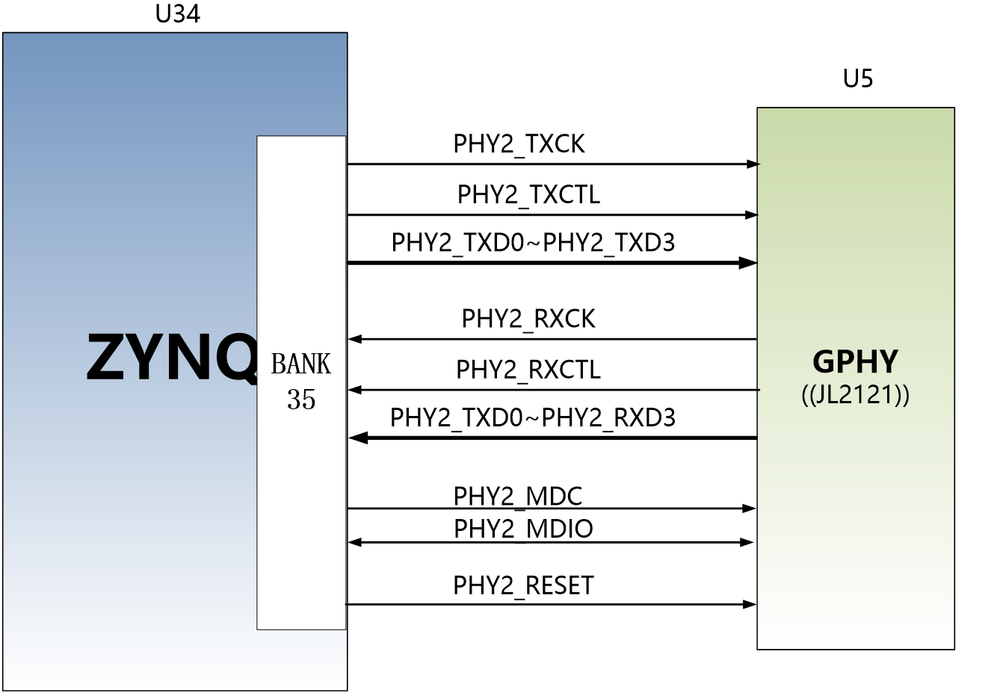

图3-2-2 ZYNQ PL端与4个GPHY连接示意图

**PS端千兆以太网引脚分配如下：**

+-----------------+----------------+-----------------+-----------------+
| **信号名称**    | **ZYNQ引脚名** | **ZYNQ引脚号**  | **备注**        |
+-----------------+----------------+-----------------+-----------------+
| **PHY1_TXCK**   | PS_MIO16_501   | D17             | RGMII 发送时钟  |
+-----------------+----------------+-----------------+-----------------+
| **PHY1_TXD0**   | PS_MIO17_501   | E14             | 发送数据bit０   |
+-----------------+----------------+-----------------+-----------------+
| **PHY1_TXD1**   | PS_MIO18_501   | A16             | 发送数据bit1    |
+-----------------+----------------+-----------------+-----------------+
| **PHY1_TXD2**   | PS_MIO19_501   | E13             | 发送数据bit2    |
+-----------------+----------------+-----------------+-----------------+
| **PHY1_TXD3**   | PS_MIO20_501   | A15             | 发送数据bit3    |
+-----------------+----------------+-----------------+-----------------+
| **PHY1_TXCTL**  | PS_MIO21_501   | F12             | 发送使能信号    |
+-----------------+----------------+-----------------+-----------------+
| **PHY1_RXCK**   | PS_MIO22_501   | A9              | RGMII接收时钟   |
+-----------------+----------------+-----------------+-----------------+
| **PHY1_RXD0**   | PS_MIO23_501   | E12             | 接收数据Bit0    |
+-----------------+----------------+-----------------+-----------------+
| **PHY1_RXD1**   | PS_MIO24_501   | B16             | 接收数据Bit1    |
+-----------------+----------------+-----------------+-----------------+
| **PHY1_RXD2**   | PS_MIO25_501   | F11             | 接收数据Bit2    |
+-----------------+----------------+-----------------+-----------------+
| **PHY1_RXD3**   | PS_MIO26_501   | A10             | 接收数据Bit3    |
+-----------------+----------------+-----------------+-----------------+
| **PHY1_RXCTL**  | PS_MIO27_501   | D16             | 接              |
|                 |                |                 | 收数据有效信号  |
+-----------------+----------------+-----------------+-----------------+
| **PHY1_MDC**    | PS_MIO52_501   | D13             | MDIO管理时钟    |
+-----------------+----------------+-----------------+-----------------+
| **PHY1_MDIO**   | PS_MIO53_501   | C11             | MDIO管理数据    |
+-----------------+----------------+-----------------+-----------------+
| **PHY1_RESET**  | PS_MIO7        | D18             | 复位信号        |
+-----------------+----------------+-----------------+-----------------+

**PL端千兆以太网引脚分配如下：**

+-----------------+----------------+-----------------+-----------------+
| **信号名称**    | **ZYNQ引脚名** | **ZYNQ引脚号**  | **备注**        |
+-----------------+----------------+-----------------+-----------------+
| **PHY2_TXCK**   | B35_L16_P      | D1              | RGMII 发送时钟  |
+-----------------+----------------+-----------------+-----------------+
| **PHY2_TXD0**   | B35_L23_P      | F2              | 发送数据bit０   |
+-----------------+----------------+-----------------+-----------------+
| **PHY2_TXD1**   | B35_L23_N      | F1              | 发送数据bit1    |
+-----------------+----------------+-----------------+-----------------+
| **PHY2_TXD2**   | B35_L17_P      | E2              | 发送数据bit2    |
+-----------------+----------------+-----------------+-----------------+
| **PHY2_TXD3**   | B35_L17_N      | D2              | 发送数据bit3    |
+-----------------+----------------+-----------------+-----------------+
| **PHY2_TXCTL**  | B35_L16_N      | C1              | 发送使能信号    |
+-----------------+----------------+-----------------+-----------------+
| **PHY2_RXCK**   | B35_L13_P      | B4              | RGMII接收时钟   |
+-----------------+----------------+-----------------+-----------------+
| **PHY2_RXD0**   | B35_L15_P      | A2              | 接收数据Bit0    |
+-----------------+----------------+-----------------+-----------------+
| **PHY2_RXD1**   | B35_L15_N      | A1              | 接收数据Bit1    |
+-----------------+----------------+-----------------+-----------------+
| **PHY2_RXD2**   | B35_L18_P      | B2              | 接收数据Bit2    |
+-----------------+----------------+-----------------+-----------------+
| **PHY2_RXD3**   | B35_L18_N      | B1              | 接收数据Bit3    |
+-----------------+----------------+-----------------+-----------------+
| **PHY2_RXCTL**  | B35_L13_N      | B3              | 接              |
|                 |                |                 | 收数据有效信号  |
+-----------------+----------------+-----------------+-----------------+
| **PHY2_MDC**    | B35_L7_P       | C8              | MDIO管理时钟    |
+-----------------+----------------+-----------------+-----------------+
| **PHY2_MDIO**   | B35_L7_P       | B8              | MDIO管理数据    |
+-----------------+----------------+-----------------+-----------------+
| **PHY2_RESET**  | B35_L8_P       | B7              | 复位信号        |
+-----------------+----------------+-----------------+-----------------+

USB2.0 Host接口
---------------

AX7015B底板上有4个USB2.0
HOST接口，USB2.0收发器采用的是一个1.8V的，高速的支持ULPI标准接口的USB3320C-EZK芯片，再通过一个USB
HUB芯片USB2514扩展出4路USB
HOST接口。ZYNQ的USB总线接口和USB3320C-EZK收发器相连接，实现高速的USB2.0
Host模式的数据通信。USB3320C的USB的数据和控制信号连接到ZYNQ芯片PS端的BANK501的IO口上，USB接口差分信号(DP/DM)连接到USB2514芯片扩展出4个USB接口。2个24MHz的晶振为分别为USB3320C和USB2514芯片提供系统时钟。

底板上为用户提供了4个USB HOST接口，USB接口为扁型USB接口(USB Type
A)，方便用户同时连接不同的USB
Slave外设(比如USB鼠标和USB键盘）。另外底板也为每个USB接口提供了+5V的电源。

ZYNQ处理器和USB3320C-EZK芯片及USB2514芯片连接的示意图如3-3-1所示：

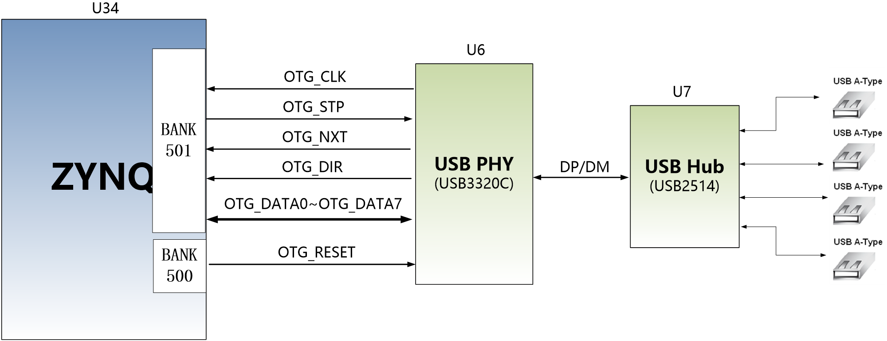

图3-3-1 Zynq7000和USB芯片间连接示意图

**USB2.0引脚分配：**

+---------------+--------------+------------+-------------------------+
| **信号名称**  | **ZY         | **ZY       | **备注**                |
|               | NQ引脚名**   | NQ引脚号** |                         |
+---------------+--------------+------------+-------------------------+
| OTG_DATA4     | PS_MIO28_501 | A11        | USB数据Bit4             |
+---------------+--------------+------------+-------------------------+
| OTG_DIR       | PS_MIO29_501 | E15        | USB数据方向信号         |
+---------------+--------------+------------+-------------------------+
| OTG_STP       | PS_MIO30_501 | A12        | USB停止信号             |
+---------------+--------------+------------+-------------------------+
| OTG_NXT       | PS_MIO31_501 | F14        | USB下一数据信号         |
+---------------+--------------+------------+-------------------------+
| OTG_DATA0     | PS_MIO32_501 | C16        | USB数据Bit0             |
+---------------+--------------+------------+-------------------------+
| OTG_DATA1     | PS_MIO33_501 | G11        | USB数据Bit1             |
+---------------+--------------+------------+-------------------------+
| OTG_DATA2     | PS_MIO34_501 | B11        | USB数据Bit2             |
+---------------+--------------+------------+-------------------------+
| OTG_DATA3     | PS_MIO35_501 | F9         | USB数据Bit3             |
+---------------+--------------+------------+-------------------------+
| OTG_CLK       | PS_MIO36_501 | A14        | USB时钟信号             |
+---------------+--------------+------------+-------------------------+
| OTG_DATA5     | PS_MIO37_501 | B9         | USB数据Bit5             |
+---------------+--------------+------------+-------------------------+
| OTG_DATA6     | PS_MIO38_501 | F10        | USB数据Bit6             |
+---------------+--------------+------------+-------------------------+
| OTG_DATA7     | PS_MIO39_501 | C10        | USB数据Bit7             |
+---------------+--------------+------------+-------------------------+
| OTG_RESETN    | PS_MIO8_500  | E18        | USB复位信号             |
+---------------+--------------+------------+-------------------------+

HDMI输出接口
------------

HDMI输出接口的实现，是选用Silion Image公司的SIL9134
HDMI（DVI）编码芯片，最高支持1080P@60Hz输出，支持3D输出。

其中，SIL9134的视频数字接口，音频数字接口和I2C配置接口和ZYNQ7000
PL部分的BANK34/35
IO相连，ZYNQ7000系统通过I2C管脚来对SIL9134进行初始化和控制操作。SIL9134芯片和ZYNQ7000的硬件连接示意图如下图3-4-1所示：

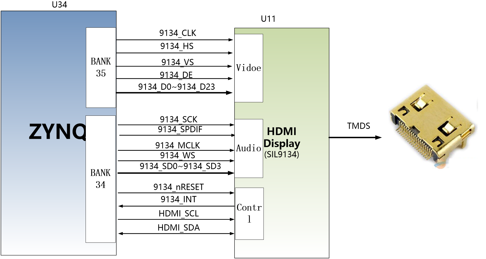

图3-4-1 HDMI接口设计原理图

**ZYNQ的引脚分配：**

+---------------+--------------+------------+-------------------------+
| **信号名称**  | **ZY         | **ZY       | **备注**                |
|               | NQ引脚名**   | NQ引脚号** |                         |
+---------------+--------------+------------+-------------------------+
| **9134_CLK**  | B35_L24_P    | H1         | 9134视频信号时钟        |
+---------------+--------------+------------+-------------------------+
| **9134_HS**   | B35_L21_P    | E4         | 9134视频信号行同步      |
+---------------+--------------+------------+-------------------------+
| **9134_VS**   | B35_L21_N    | E3         | 9134视频信号列同步      |
+---------------+--------------+------------+-------------------------+
| **9134_DE**   | B35_L22_N    | G2         | 9134视频信号有效        |
+---------------+--------------+------------+-------------------------+
| **9134_D[0]** | B35_L22_P    | G3         | 9134视频信号数据0       |
+---------------+--------------+------------+-------------------------+
| **9134_D[1]** | B35_L19_N    | H3         | 9134视频信号数据1       |
+---------------+--------------+------------+-------------------------+
| **9134_D[2]** | B35_L19_P    | H4         | 9134视频信号数据2       |
+---------------+--------------+------------+-------------------------+
| **9134_D[3]** | B35_L4_N     | G7         | 9134视频信号数据3       |
+---------------+--------------+------------+-------------------------+
| **9134_D[4]** | B35_L4_P     | G8         | 9134视频信号数据4       |
+---------------+--------------+------------+-------------------------+
| **9134_D[5]** | B35_L24_N    | G1         | 9134视频信号数据5       |
+---------------+--------------+------------+-------------------------+
| **9134_D[6]** | B35_IO25     | H5         | 9134视频信号数据6       |
+---------------+--------------+------------+-------------------------+
| **9134_D[7]** | B35_IO0      | H6         | 9134视频信号数据7       |
+---------------+--------------+------------+-------------------------+
| **9134_D[8]** | B35_L20_P    | G4         | 9134视频信号数据8       |
+---------------+--------------+------------+-------------------------+
| **9134_D[9]** | B35_L20_N    | F4         | 9134视频信号数据9       |
+---------------+--------------+------------+-------------------------+
| **9           | B35_L5_P     | F5         | 9134视频信号数据10      |
| 134_D[10]**   |              |            |                         |
+---------------+--------------+------------+-------------------------+
| **9           | B35_L5_N     | E5         | 9134视频信号数据11      |
| 134_D[11]**   |              |            |                         |
+---------------+--------------+------------+-------------------------+
| **9           | B35_L6_P     | G6         | 9134视频信号数据12      |
| 134_D[12]**   |              |            |                         |
+---------------+--------------+------------+-------------------------+
| **9           | B35_L6_N     | F6         | 9134视频信号数据13      |
| 134_D[13]**   |              |            |                         |
+---------------+--------------+------------+-------------------------+
| **9           | B35_L1_N     | E7         | 9134视频信号数据14      |
| 134_D[14]**   |              |            |                         |
+---------------+--------------+------------+-------------------------+
| **9           | B35_L1_P     | F7         | 9134视频信号数据15      |
| 134_D[15]**   |              |            |                         |
+---------------+--------------+------------+-------------------------+
| **9           | B35_L14_P    | D3         | 9134视频信号数据16      |
| 134_D[16]**   |              |            |                         |
+---------------+--------------+------------+-------------------------+
| **9           | B35_L14_N    | C3         | 9134视频信号数据17      |
| 134_D[17]**   |              |            |                         |
+---------------+--------------+------------+-------------------------+
| **9           | B35_L12_N    | C4         | 9134视频信号数据18      |
| 134_D[18]**   |              |            |                         |
+---------------+--------------+------------+-------------------------+
| **9           | B35_L12_P    | D5         | 9134视频信号数据19      |
| 134_D[19]**   |              |            |                         |
+---------------+--------------+------------+-------------------------+
| **9           | B35_L11_N    | C5         | 9134视频信号数据20      |
| 134_D[20]**   |              |            |                         |
+---------------+--------------+------------+-------------------------+
| **9           | B35_L11_P    | C6         | 9134视频信号数据21      |
| 134_D[21]**   |              |            |                         |
+---------------+--------------+------------+-------------------------+
| **9           | B35_L3_P     | E8         | 9134视频信号数据22      |
| 134_D[22]**   |              |            |                         |
+---------------+--------------+------------+-------------------------+
| **9           | B35_L3_N     | D8         | 9134视频信号数据23      |
| 134_D[23]**   |              |            |                         |
+---------------+--------------+------------+-------------------------+
| **9134_SCK**  | B34_L2_N     | J6         | 9134音频接口I2S时钟     |
+---------------+--------------+------------+-------------------------+
| **9           | B34_L21_N    | N3         | 9134音频S/PDIF输入      |
| 134_SPDIF**   |              |            |                         |
+---------------+--------------+------------+-------------------------+
| **9134_MCLK** | B34_L21_P    | N4         | 9134音频输入主时钟      |
+---------------+--------------+------------+-------------------------+
| **9134_WS**   | B34_L2_P     | J7         | 9134音频接口I2S字选择   |
+---------------+--------------+------------+-------------------------+
| **9134_SD0**  | B34_L19_N    | N5         | 9134音频接口I2S数据     |
+---------------+--------------+------------+-------------------------+
| **9134_SD1**  | B34_L19_P    | N6         | 9134音频接口I2S数据     |
+---------------+--------------+------------+-------------------------+
| **9134_SD2**  | B34_L13_N    | T1         | 9134音频接口I2S数据     |
+---------------+--------------+------------+-------------------------+
| **9134_SD3**  | B34_L13_P    | T2         | 9134音频接口I2S数据     |
+---------------+--------------+------------+-------------------------+
| **9           | B34_L12_N    | L4         | 9134复位信号            |
| 134_nRESET**  |              |            |                         |
+---------------+--------------+------------+-------------------------+
| **9134_INT**  | B34_L12_P    | L5         | 9134中断信号            |
+---------------+--------------+------------+-------------------------+
| **HDMI_SCL**  | B34_L1_P     | J8         | 9134 IIC控制时钟        |
+---------------+--------------+------------+-------------------------+
| **HDMI        | B34_L1_N     | K8         | 9134 IIC控制数据        |
| \_SDA**       |              |            |                         |
+---------------+--------------+------------+-------------------------+

HDMI输入接口
------------

HDMI输入接口我们采用了Silion Image公司的SIL9013
HDMI解码芯片，最高支持1080P@60Hz输入，支持不同格式的数据输出。；

其中，SIL9013的IIC配置接口也与FPGA的BANK13的IO相连，ZYNQ通过I2C总线的编程来对SIL9013进行初始化和控制操作，HDMI输入接口的硬件连接如图3-5-1所示。

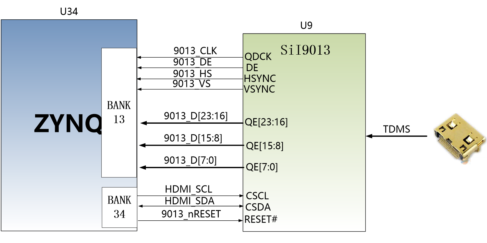

图3-5-1 HDMI 输入原理图

**ZYNQ的引脚分配：**

+---------------+--------------+------------+-------------------------+
| **信号名称**  | **ZY         | **ZY       | **备注**                |
|               | NQ引脚名**   | NQ引脚号** |                         |
+---------------+--------------+------------+-------------------------+
| **9           | B34_L16_N    | P1         | 9013复位信号            |
| 013_nRESET**  |              |            |                         |
+---------------+--------------+------------+-------------------------+
| **9013_CLK**  | B13_L14_P    | AA16       | 9013视频信号时钟        |
+---------------+--------------+------------+-------------------------+
| **9013_HS**   | B13_L20_P    | U19        | 9013视频信号行同步      |
+---------------+--------------+------------+-------------------------+
| **9013_VS**   | B13_L22_N    | U18        | 9013视频信号列同步      |
+---------------+--------------+------------+-------------------------+
| **9013_DE**   | B13_L20_N    | V19        | 9013视频信号有效        |
+---------------+--------------+------------+-------------------------+
| **9013_D[0]** | B13_L22_P    | U17        | 9013视频信号数据0       |
+---------------+--------------+------------+-------------------------+
| **9013_D[1]** | B13_L23_P    | V16        | 9013视频信号数据1       |
+---------------+--------------+------------+-------------------------+
| **9013_D[2]** | B13_L23_N    | W16        | 9013视频信号数据2       |
+---------------+--------------+------------+-------------------------+
| **9013_D[3]** | B13_L14_N    | AA17       | 9013视频信号数据3       |
+---------------+--------------+------------+-------------------------+
| **9013_D[4]** | B13_L13_N    | Y19        | 9013视频信号数据4       |
+---------------+--------------+------------+-------------------------+
| **9013_D[5]** | B13_L13_P    | Y18        | 9013视频信号数据5       |
+---------------+--------------+------------+-------------------------+
| **9013_D[6]** | B13_L11_N    | AA15       | 9013视频信号数据6       |
+---------------+--------------+------------+-------------------------+
| **9013_D[7]** | B13_L11_P    | AA14       | 9013视频信号数据7       |
+---------------+--------------+------------+-------------------------+
| **9013_D[8]** | B13_L17_P    | AB16       | 9013视频信号数据8       |
+---------------+--------------+------------+-------------------------+
| **9013_D[9]** | B13_L17_N    | AB17       | 9013视频信号数据9       |
+---------------+--------------+------------+-------------------------+
| **9           | B13_L16_N    | AB19       | 9013视频信号数据10      |
| 013_D[10]**   |              |            |                         |
+---------------+--------------+------------+-------------------------+
| **9           | B13_L16_P    | AB18       | 9013视频信号数据11      |
| 013_D[11]**   |              |            |                         |
+---------------+--------------+------------+-------------------------+
| **9           | B13_L12_N    | Y15        | 9013视频信号数据12      |
| 013_D[12]**   |              |            |                         |
+---------------+--------------+------------+-------------------------+
| **9           | B13_IO25     | U16        | 9013视频信号数据13      |
| 013_D[13]**   |              |            |                         |
+---------------+--------------+------------+-------------------------+
| **9           | B13_L1_N     | V14        | 9013视频信号数据14      |
| 013_D[14]**   |              |            |                         |
+---------------+--------------+------------+-------------------------+
| **9           | B13_L1_P     | V13        | 9013视频信号数据15      |
| 013_D[15]**   |              |            |                         |
+---------------+--------------+------------+-------------------------+
| **9           | B13_L7_N     | AB11       | 9013视频信号数据16      |
| 013_D[16]**   |              |            |                         |
+---------------+--------------+------------+-------------------------+
| **9           | B13_L7_P     | AA11       | 9013视频信号数据17      |
| 013_D[17]**   |              |            |                         |
+---------------+--------------+------------+-------------------------+
| **9           | B13_L4_P     | V11        | 9013视频信号数据18      |
| 013_D[18]**   |              |            |                         |
+---------------+--------------+------------+-------------------------+
| **9           | B13_L4_N     | W11        | 9013视频信号数据19      |
| 013_D[19]**   |              |            |                         |
+---------------+--------------+------------+-------------------------+
| **9           | B13_L3_P     | W12        | 9013视频信号数据20      |
| 013_D[20]**   |              |            |                         |
+---------------+--------------+------------+-------------------------+
| **9           | B13_L3_N     | W13        | 9013视频信号数据21      |
| 013_D[21]**   |              |            |                         |
+---------------+--------------+------------+-------------------------+
| **9           | B13_L5_N     | U12        | 9013视频信号数据22      |
| 013_D[22]**   |              |            |                         |
+---------------+--------------+------------+-------------------------+
| **9           | B13_L5_P     | U11        | 9013视频信号数据23      |
| 013_D[23]**   |              |            |                         |
+---------------+--------------+------------+-------------------------+
| **HDMI_SCL**  | B34_L1_P     | J8         | 9013 IIC控制时钟        |
+---------------+--------------+------------+-------------------------+
| **HDMI        | B34_L1_N     | K8         | 9013 IIC控制数据        |
| \_SDA**       |              |            |                         |
+---------------+--------------+------------+-------------------------+

光纤接口
--------

AX7015B扩展板上有2路光纤接口，用户可以购买光模块(市场上1.25G，2.5G光模块）插入到这2个光纤接口中进行光纤数据通信。2路光纤接口分别跟ZYNQ的GTP收发器的2路RX/TX相连接，TX信号和RX信号都是以差分信号方式通过隔直电容连接ZYNQ和光模块，每路TX发送和RX接收数据速率高达6.125Gb/s。GTP收发器的参考时钟由核心板上的125M差分晶振提供。

FPGA和光纤设计示意图如下图3-6-1所示:

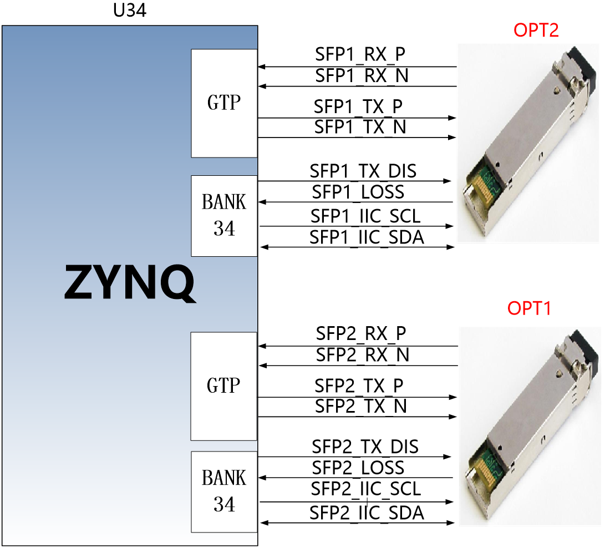

图3-6-1光纤设计示意图

两路光纤接口在扩展板的实物图如下图所示:

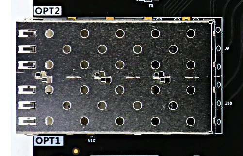

两路光纤通信接口实物图

   **OPT2光纤接口ZYNQ引脚分配如下：**

+------------------+----------------+---------------------------------+
| **网络名称**     | **ZYNQ引脚**   | **备注**                        |
+------------------+----------------+---------------------------------+
| **SFP1_TX_P**    | W2             | SFP光模块数据发送 Positive      |
+------------------+----------------+---------------------------------+
| **SFP1_TX_N**    | Y2             | SFP光模块数据发送Negative       |
+------------------+----------------+---------------------------------+
| **SFP1_RX_P**    | W6             | SFP光模块数据接收 Positive      |
+------------------+----------------+---------------------------------+
| **SFP1_RX_N**    | Y6             | SFP光模块数据接收Negative       |
+------------------+----------------+---------------------------------+
| **SFP1_TX_DIS**  | U1             | SFP光模块光发射禁止，高有效     |
+------------------+----------------+---------------------------------+
| **SFP1_LOSS**    | U2             | SFP光接收L                      |
|                  |                | OSS信号，高表示没有接收到光信号 |
+------------------+----------------+---------------------------------+
| **SFP1_IIC_SCL** | K7             | SFP光模块DDMI的I2C时钟          |
+------------------+----------------+---------------------------------+
| **SFP1_IIC_SDA** | L7             | SFP光模块DDMI的I2C数据          |
+------------------+----------------+---------------------------------+

注意：以上的管脚定义为AX7015B底板PCB板上丝印OPT2光纤接口

   **OPT1光纤接口ZYNQ引脚分配如下：**

+------------------+----------------+---------------------------------+
| **网络名称**     | **ZYNQ引脚**   | **备注**                        |
+------------------+----------------+---------------------------------+
| **SFP2_TX_P**    | AA5            | SFP光模块数据发送 Positive      |
+------------------+----------------+---------------------------------+
| **SFP2_TX_N**    | AB5            | SFP光模块数据发送Negative       |
+------------------+----------------+---------------------------------+
| **SFP2_RX_P**    | AA9            | SFP光模块数据接收 Positive      |
+------------------+----------------+---------------------------------+
| **SFP2_RX_N**    | AB9            | SFP光模块数据接收Negative       |
+------------------+----------------+---------------------------------+
| **SFP2_TX_DIS**  | K2             | SFP光模块光发射禁止，高有效     |
+------------------+----------------+---------------------------------+
| **SFP2_LOSS**    | K5             | SFP光接收L                      |
|                  |                | OSS信号，高表示没有接收到光信号 |
+------------------+----------------+---------------------------------+
| **SFP2_IIC_SCL** | J5             | SFP光模块DDMI的I2C时钟          |
+------------------+----------------+---------------------------------+
| **SFP2_IIC_SDA** | J3             | SFP光模块DDMI的I2C数据          |
+------------------+----------------+---------------------------------+

注意：以上的管脚定义为AX7015B底板PCB板上丝印OPT1光纤接口

PCIe x2接口
-----------

AX7015B扩展板上提供一个工业级高速数据传输PCIe
x2接口，PCIE卡的外形尺寸符合标准PCIe卡电气规范要求，可直接在普通台式机的
PCIe插槽上使用。

PCIe接口的收发信号直接跟FPGA的GTP收发器相连接，2通道的TX信号和RX信号都是以差分信号方式连接到FPGA，单通道通信速率可高达5G
bit带宽。PCIe的参考时钟由电脑的PCIe插槽提供给开发板，参考时钟频率为100Mhz。

开发板的PCIe接口的设计示意图如下图3-7-1所示,其中TX发送信号和参考时钟CLK信号用AC耦合模式连接。

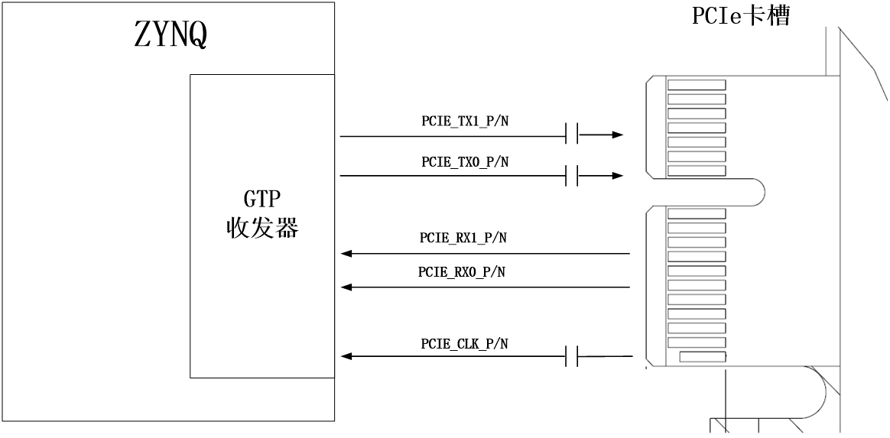

图3-7-1 PCIe x2设计示意图

   **PCIe x2接口FPGA引脚分配如下：**

+------------------+----------------+---------------------------------+
| **网络名称**     | **FPGA引脚**   | **备注**                        |
+------------------+----------------+---------------------------------+
| PCIE_RX0_P       | W8             | PCIE通道0数据接收 Positive      |
+------------------+----------------+---------------------------------+
| PCIE_RX0_N       | Y8             | PCIE通道0数据接收Negative       |
+------------------+----------------+---------------------------------+
| PCIE_RX1_P       | AA7            | PCIE通道1数据接收 Positive      |
+------------------+----------------+---------------------------------+
| PCIE_RX1_N       | AB7            | PCIE通道1数据接收Negative       |
+------------------+----------------+---------------------------------+
| PCIE_TX0_P       | W4             | PCIE通道0数据发送 Positive      |
+------------------+----------------+---------------------------------+
| PCIE_TX0_N       | Y4             | PCIE通道0数据发送Negative       |
+------------------+----------------+---------------------------------+
| PCIE_TX1_P       | AA3            | PCIE通道1数据发送 Positive      |
+------------------+----------------+---------------------------------+
| PCIE_TX1_N       | AB3            | PCIE通道1数据发送Negative       |
+------------------+----------------+---------------------------------+
| PCIE_CLK_P       | U9             | PCIE的参考时钟 Positive         |
+------------------+----------------+---------------------------------+
| PCIE_CLK_N       | V9             | PCIE的参考时钟Negative          |
+------------------+----------------+---------------------------------+

.. _usb转串口-1:

USB转串口
---------

AX7015B底板上也配有串口接口，用于ZYNQ7000系统的整体调试，
转换芯片采用Silicon Labs CP2102GM的USB-UAR芯片, USB接口采用MINI
USB接口，可以用一根USB线将它连接到上PC的USB口进行核心板的单独供电和串口数据通信
。

USB Uart电路设计的示意图如下图3-8-1所示:

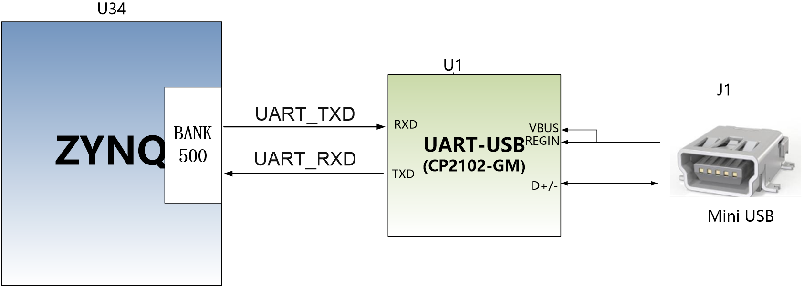

3-8-1 USB转串口示意图

**UART转串口的ZYNQ引脚分配：**

+---------------+--------------+------------+-------------------------+
| **信号名称**  | **ZY         | **ZY       | **备注**                |
|               | NQ引脚名**   | NQ引脚号** |                         |
+---------------+--------------+------------+-------------------------+
| UART_RXD      | PS_MIO13_500 | A17        | Uart数据输入            |
+---------------+--------------+------------+-------------------------+
| UART_TXD      | PS_MIO12_500 | C18        | Uart数据输出            |
+---------------+--------------+------------+-------------------------+

SD卡槽
------

AX7015B底板包含了一个Micro型的SD卡接口，以提供用户访问SD卡存储器，用于存储ZYNQ芯片的BOOT程序，Linux操作系统内核,
文件系统以及其它的用户数据文件。

SDIO信号与ZYNQ的PS
BANK501的IO信号相连，因为该BANK的VCCMIO设置为1.8V，但SD卡的数据电平为3.3V,
我们这里通过TXS02612电平转换器来连接。Zynq7000
PS和SD卡连接器的原理图如图3-9-1所示。

.. image:: images/media/image32.png

图3-9-1 SD卡连接示意图

**SD卡槽引脚分配**

+---------------+--------------+------------+-------------------------+
| **信号名称**  | **ZY         | **ZY       | **备注**                |
|               | NQ引脚名**   | NQ引脚号** |                         |
+---------------+--------------+------------+-------------------------+
| SD_CLK        | PS_MIO40     | E9         | SD时钟信号              |
+---------------+--------------+------------+-------------------------+
| SD_CMD        | PS_MIO41     | C15        | SD命令信号              |
+---------------+--------------+------------+-------------------------+
| SD_D0         | PS_MIO42     | D15        | SD数据Data0             |
+---------------+--------------+------------+-------------------------+
| SD_D1         | PS_MIO43     | B12        | SD数据Data1             |
+---------------+--------------+------------+-------------------------+
| SD_D2         | PS_MIO44     | E10        | SD数据Data2             |
+---------------+--------------+------------+-------------------------+
| SD_D3         | PS_MIO45     | B14        | SD数据Data3             |
+---------------+--------------+------------+-------------------------+
| SD_CD         | PS_MIO10     | G16        | SD卡插入信号            |
+---------------+--------------+------------+-------------------------+

.. _jtag接口-1:

JTAG接口
--------

在AX7015B底板上预留了一个JTAG接口，用于下载FPGA程序或者固化程序到FLASH。为了带电插拔造成对FPGA芯片的损坏，我们在JTAG信号上添加了保护二极管来保证信号的电压在FPGA接受的范围，避免FPGA的损坏。

   .. image:: images/media/image33.png
      
   图3-10-1 JTAG接口原理图

   下图为扩展板上JTAG接口实物图，用户可以通过我们提供的USB下载器连接PC和JTAG接口进行ZYNQ的系统调试
   JTAG线插拔的时候注意不要热插拔。

.. _led灯-1:

LED灯
-----

AX7015B底板上有6个红色LED灯，其中1个是电源指示灯(PWR)，
5个是用户LED灯。当底板供电后，电源指示灯会亮起；
5个用户LED灯一个连接到PS的MIO上，另外四个连接到PL的IO上，用户可以通过程序来控制亮和灭，当连接用户LED灯的IO电压为高时，用户LED灯熄灭，当连接IO电压为低时，用户LED会被点亮。LED灯硬件连接的示意图如图3-11-1所示：

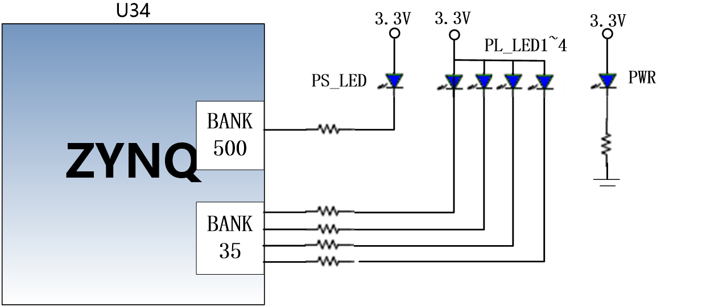

图3-11-1 底板LED灯硬件连接示意图

**底板用户LED灯的引脚分配**

+--------------+------------------+--------------+--------------------+
| **信号名称** | **ZYNQ引脚名**   | **ZY         | **备注**           |
|              |                  | NQ管脚号**   |                    |
+--------------+------------------+--------------+--------------------+
| PS_LED       | PS_MIO9_500      | C19          | PS端用户LED灯      |
+--------------+------------------+--------------+--------------------+
| PL_LED1      | B35_L10_P        | A5           | PL端用户LED1灯     |
+--------------+------------------+--------------+--------------------+
| PL_LED2      | B35_L9_P         | A7           | PL端用户LED2灯     |
+--------------+------------------+--------------+--------------------+
| PL_LED3      | B35_L9_N         | A6           | PL端用户LED3灯     |
+--------------+------------------+--------------+--------------------+
| PL_LED4      | B35_L7_N         | B8           | PL端用户LED4灯     |
+--------------+------------------+--------------+--------------------+

用户按键
--------

AX7015B底板上有2个用户按键PS KEY和PL KEY，PS
KEY连接到ZYNQ芯片PS的MIO管脚上，PL
KEY连接到ZYNQ芯片PL的IO管脚上。按键按下，信号为低，ZYNQ芯片就是检测到低电平来判断按键是否按下。用户按键连接的示意图如图3-12-1所示：

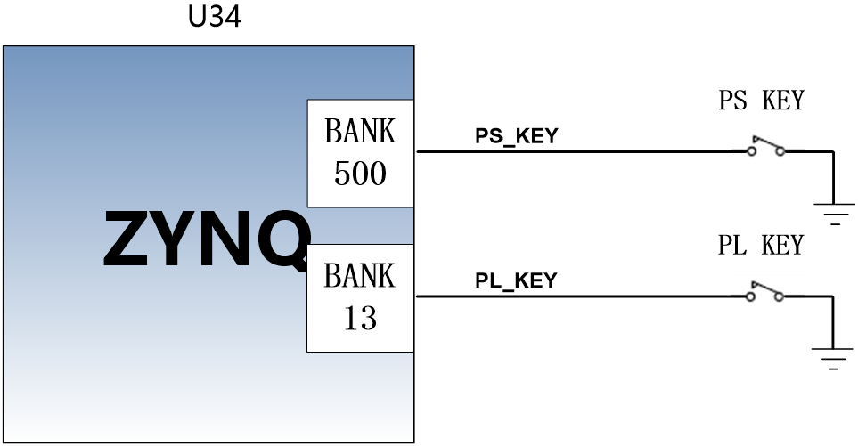

图3-12-1 用户按键连接示意图

**用户按键的ZYNQ管脚分配**

+---------------+---------------+------------+------------------------+
| **信号名称**  | **ZY          | **ZY       | **备注**               |
|               | NQ引脚名**    | NQ引脚号** |                        |
+---------------+---------------+------------+------------------------+
| PS_KEY        | PS_MIO11_500  | B19        | ZYNQ系统复位信号       |
+---------------+---------------+------------+------------------------+
| PL_KEY        | B13_L8_N      | AB12       | PL端的用户按键         |
+---------------+---------------+------------+------------------------+

扩展口
------

AX7015B底板预留了1个2.54mm标准间距的40针的扩展口J12，用于连接黑金的各个模块或者用户自己设计的外面电路，扩展口有40个信号，其中，5V电源1路，3.3V电源2路，地3路，IO口34路。\ **切勿IO直接跟5V设备直接连接，以免烧坏ZYNQ7000芯片。如果要接5V设备，需要接电平转换芯片。**

扩展口(J12)的电路如下图3-13-1所示

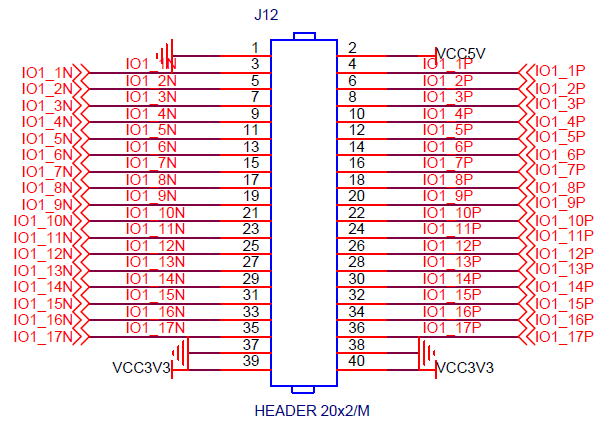

图3-13-1扩展口J12原理图

**J12扩展口ZYNQ的引脚分配**

+-----------------+------------------+---------------+-----------------+
| **引脚编号**    | **ZYNQ引脚**     | **引脚编号**  | **ZYNQ引脚**    |
+-----------------+------------------+---------------+-----------------+
| **1**           | GND              | **2**         | +5V（输出）     |
+-----------------+------------------+---------------+-----------------+
| **3**           | M1               | **4**         | M2              |
+-----------------+------------------+---------------+-----------------+
| **5**           | Y13              | **6**         | Y12             |
+-----------------+------------------+---------------+-----------------+
| **7**           | P2               | **8**         | P3              |
+-----------------+------------------+---------------+-----------------+
| **9**           | R7               | **10**        | P7              |
+-----------------+------------------+---------------+-----------------+
| **11**          | P8               | **12**        | N8              |
+-----------------+------------------+---------------+-----------------+
| **13**          | R2               | **14**        | R3              |
+-----------------+------------------+---------------+-----------------+
| **15**          | R4               | **16**        | R5              |
+-----------------+------------------+---------------+-----------------+
| **17**          | M7               | **18**        | M8              |
+-----------------+------------------+---------------+-----------------+
| **19**          | M3               | **20**        | M4              |
+-----------------+------------------+---------------+-----------------+
| **21**          | U14              | **22**        | U13             |
+-----------------+------------------+---------------+-----------------+
| **23**          | AB14             | **24**        | AB13            |
+-----------------+------------------+---------------+-----------------+
| **25**          | W15              | **26**        | V15             |
+-----------------+------------------+---------------+-----------------+
| **27**          | Y17              | **28**        | W17             |
+-----------------+------------------+---------------+-----------------+
| **29**          | W18              | **30**        | V18             |
+-----------------+------------------+---------------+-----------------+
| **31**          | AB22             | **32**        | AB21            |
+-----------------+------------------+---------------+-----------------+
| **33**          | AA20             | **34**        | AA19            |
+-----------------+------------------+---------------+-----------------+
| **35**          | T17              | **36**        | R17             |
+-----------------+------------------+---------------+-----------------+
| **37**          | GND              | **38**        | GND             |
+-----------------+------------------+---------------+-----------------+
| **39**          | +3.3V（输出）    | **40**        | +3.3V（输出）   |
+-----------------+------------------+---------------+-----------------+

供电电源
--------

开发板的电源输入电压为DC12V，可以通过PCIE插槽或者外接+12V电源给板子供电。外接电源供电时请使用开发板自带的电源,不要用其他规格的电源，以免损坏开发板。底板上通过3路DC/DC电源芯片ETA1471FT2G转换成+5V，+3.3V和1.8V四路电源。扩展上的电源设计如下图3-14-1所示:

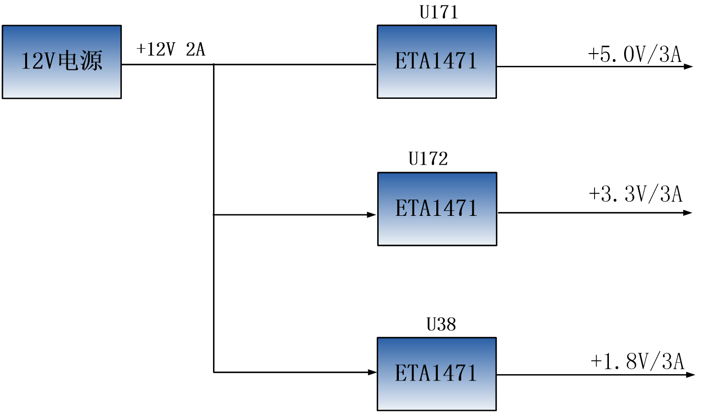

图3-14-1底板电源原理图

底板结构图
----------

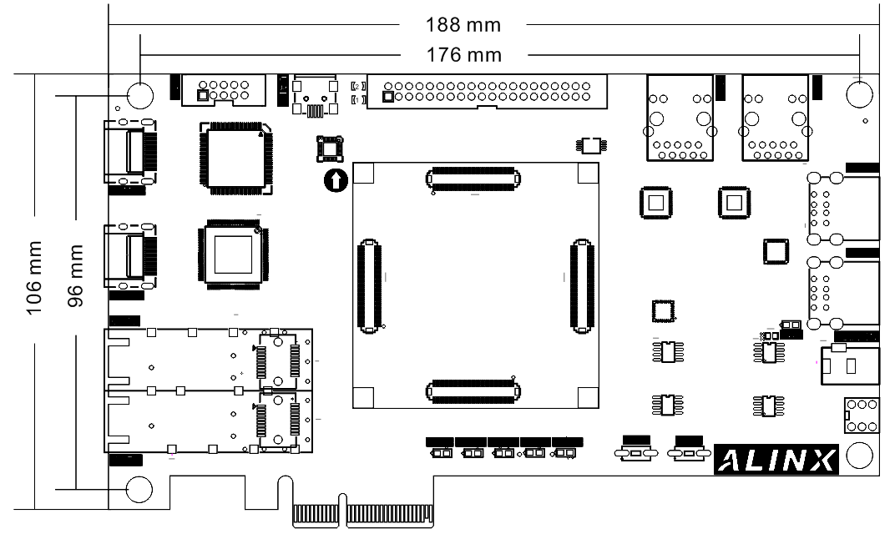

正面图（Top View）

.. |image1| image:: images/media/image1.png
.. |image2| image:: images/media/image20.png
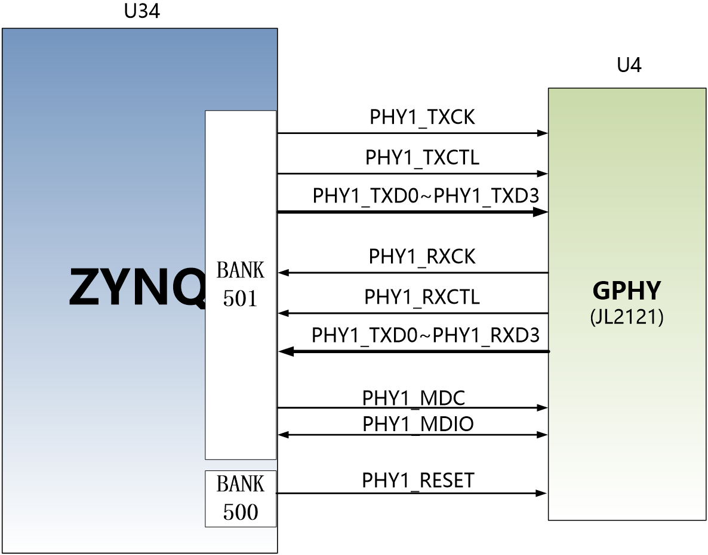
